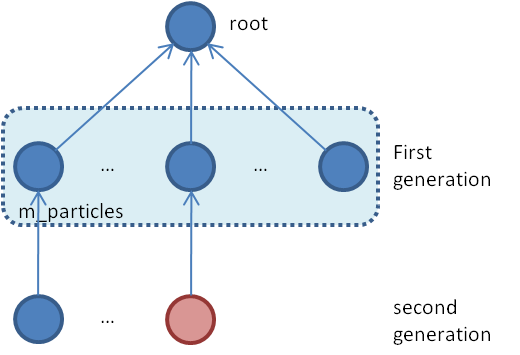
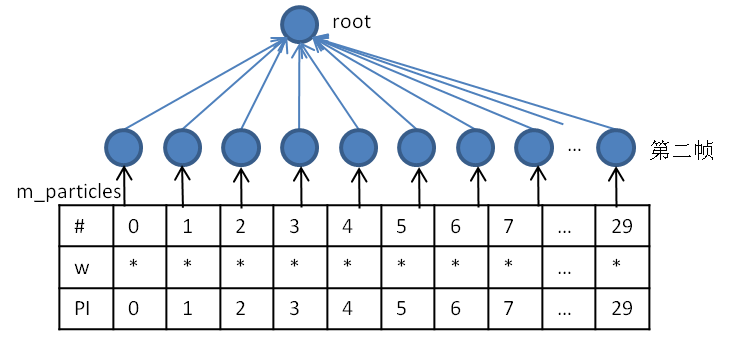

# GMAPPING-SLAM流程与函数详细说明

##  参考资料

### 理论参考网络资料

>  https://www.cnblogs.com/yhlx125/p/5634128.html

>  https://blog.csdn.net/roadseek_zw/article/details/53316177

>  https://blog.csdn.net/roadseek_zw/article/details/53316177

### 论文

>  Improved Techniques for Grid Mapping with Rao-Blackwellized Particle Filters.pdf

### 书

>  Probabilistic Robotic


## 1. 总流程

gmapping的实现基于粒子滤波，利用30个粒子对位姿进行优化。每次扫描都要对所有的粒子用运动模型确定位姿，以及计算微调位姿的最优得分及最佳位姿。根据粒子权重的分布情况对粒子进行筛选，保留权重大的粒子。从而提高精度。


## 2. 数据类型

1. 位姿

   ```c++
   typedef orientedpoint<double, double> OrientedPoint;
   inline orientedpoint():point<T>(0,0), theta(0) {};
   ```

   包括坐标x, y和角度theta

2. 扫描光束

   ```c++
   class RangeReading:public SensorReading, public std::vector<double>{};
   ```

   是double类型的向量，存储扫描光束终端距离sensor的欧式距离。

3. 粒子向量

   ```c++
   typedef std::vector<Particle> ParticleVector;
   ```

   Particle结构包括参数：

   ```c++
   /** The map */
   ScanMatcherMap map;
   /** The pose of the robot */
   OrientedPoint pose;
   /** The pose of the robot at the previous time frame (used for computing thr odometry displacements) */
   OrientedPoint previousPose;
   /** The weight of the particle */
   double weight;
   /** The cumulative weight of the particle */
   double weightSum;
   double gweight;
   /** The index of the previous particle in the trajectory tree */
   int previousIndex;
   /** Entry to the trajectory tree */
   TNode* node;  
   ```

4. 节点

   节点用来将粒子构建成树类型。用于计算权重和筛选粒子。

   ```c++
   struct TNode{
   	/**Constructs a node of the trajectory tree.
   	@param pose:      the pose of the robot in the trajectory
   	@param weight:    the weight of the particle at that point in the trajectory
   	@param accWeight: the cumulative weight of the particle
   	@param parent:    the parent node in the tree
   	@param childs:    the number of childs
   	*/
   };
   ```

## 3. 数据来源及传输

××


## 4. 函数解析——drawFromMotion()

```c++
//arg1: 粒子的t-1时刻的位姿(p，const orientedpoint<T,A>)
//arg2: 当前t时刻的里程计读数(pnew，const orientedpoint<T,A>)
//arg3: t-1时刻的里程计读数(pold，const orientedpoint<T,A>)
//retn: 粒子的t时刻的位姿(p，const orientedpoint<T,A>)
```


1. 计算t时刻和t-1时刻的里程计的读数之差，并从世界坐标系拆分到t-1时刻robot坐标系中。

   ```c++
   orientedpoint<T,A> delta=p1-p2;
   delta.theta=atan2(sin(delta.theta), cos(delta.theta));
   double s=sin(p2.theta), c=cos(p2.theta);
   return orientedpoint<T,A>(c*delta.x+s*delta.y, -s*delta.x+c*delta.y, delta.theta);
   ```

   

2. 在里程计读数之差的基础上添加噪声，并归一化角度范围。

3. 将带噪声的里程计读数之差附加到t-1时刻的粒子位姿上，并将坐标系从粒子坐标系转换回世界坐标系，得到新的粒子位姿。

   ```c++
   double s=sin(p1.theta), c=cos(p1.theta);
   return orientedpoint<T,A>(c*p2.x-s*p2.y, s*p2.x+c*p2.y, p2.theta) + p1; 
   ```

   

4. 其他参数：

   ```c++
   double srr, str, srt, stt;
   //srr里程计的平移/平移  
   //srt里程计的平移/旋转  
   //stt里程计的旋转/旋转  
   //str里程计的旋转/平移
   //srr=0.01, srt=0.01, str=0.01, stt=0.01;
   double sxy=0.3*srr;
   //目测是两轮轴间耦合方差
   ```

## 5. 函数解析——scanMatch()

```c++
//scanMatch()扫描匹配获取最优的采样粒子。GMapping默认采用30个采样粒子。
//arg1: 粒子的t时刻的位姿，t时刻激光雷达扫描光束终端的距离信息(plainReading，const double*)
//retn: 更新了粒子的t时刻的权重(it->weight，double) 以及地图状态
```


对每个粒子：

- 对粒子进行微调，计算当前最佳位姿及得分。
-  计算粒子的权重。
-  计算地图的有效区域。

1. **optimize()**

   ```c++
   //optimize()计算得分最优的粒子
   //arg1: 位姿微调后的最佳位姿(corrected，const orientedpoint<T,A>)
   //arg2: 粒子的网格地图(map，const ScanMatcherMap)
   //arg3: 粒子的t时刻的位姿(init，const orientedpoint<T,A>)
   //arg4: 激光雷达扫描光束终端的距离信息(readings, const double*)
   //retn: 位姿微调后的最佳得分(bestScore, double)  
   ```

   

   调用了score()函数计算粒子得分。利用粒子的运动+score()中激光扫描观测数据。

   按照预先设定的步长前、后、左、右、左转、右转移动粒子的位置，分别根据提议分布计算得分，将得分最大的那个微调位姿作为粒子的新的位姿，将最大的得分作为粒子最佳得分。

   

2. **score()**

   ```c++
   //score()计算粒子得分
   //arg1: 粒子的网格地图(map，const ScanMatcherMap)
   //arg2: 粒子的t时刻的位姿(init，const orientedpoint<T,A>)
   //arg3: 激光雷达扫描光束终端的距离信息(readings, const double*)
   //retn: 粒子得分(currentScore, double)
   ```

   原理是likelihood_field_range_finder_model方法，参考《Probabilistic_Robotics》P172。

   

   

   公式(6.32)结合了两个部分：

   ```c++
   OrientedPoint lp=p;
   lp.x+=cos(p.theta)*m_laserPose.x-sin(p.theta)*m_laserPose.y;
   lp.y+=sin(p.theta)*m_laserPose.x+cos(p.theta)*m_laserPose.y;
   lp.theta+=m_laserPose.theta;
   ```

   1. 将激光雷达传感器相对于robot的位姿转换成激光雷达相对于世界坐标系的位姿。

      也就是考虑了激光雷达与robot之间的结构尺寸，而不是简单地认为两者在同一中心上。

      

      robot在世界坐标系中的坐标为lp=p。

      sensor在robot坐标系中的坐标为m_laserPose。

      上述转换将sensor从robot坐标系转换到世界坐标系中，包括平移和旋转。

      ```c++
      Point phit=lp;//计算障碍物坐标
      phit.x+=*r*cos(lp.theta+*angle);
      phit.y+=*r*sin(lp.theta+*angle);
      ```

   2. 将扫描光束相对于激光雷达的位姿转换成相对于世界坐标系的位姿。扫描光束相对于激光雷达有一个距离和夹角。

      

      sensor在世界坐标系中的坐标为lp。由坐标变换而来。

      激光光束在sensor坐标系中有两个信息，光束终端的距离r和相对sensor的偏转角angle。

      上述转换将光束终端从sensor坐标系转换到世界坐标系中。

      

      sensor在世界坐标系中的坐标为lp。由坐标变换而来。

      激光光束在sensor坐标系中有两个信息，光束终端的距离r和相对sensor的偏转角angle。

      取某一条光束的终端信息为例。转化成整数网格坐标phit(红色数据)

      根据定义的自由网格距离，计算该光束的远离障碍物的坐标，并计算增量pfree(绿色数据)

      在光束终端的整数坐标附近8邻域范围内，依次循环邻域的点pr。(浅蓝色网格8邻域)

      同时，对每个领域的坐标点pr计算pfree增量处的坐标点pf。pr和pf一一对应。(浅紫色网格)

      累加pr坐标和pf坐标，pr大于某一阈值，pf小于该阈值，且pr栅格的phit的平均坐标与phit的距离bestMu最小。（坐标点的乘积=x\*x+y\*y）

      得分计算： s +=exp(-1.0/m_gaussianSigma\*bestMu\*besMu)  参考NDT算法：距离越大，分数越小，分数的较大值集中在距离最小值处，符合正态分布模型

      

3. **likelihoodAndScore()**

   ```c++
   //likelihoodAndScore()计算粒子得分和权重l，如果出现匹配失败，则 l=noHit
   //arg1: 粒子得分(s，double)
   //arg2: 粒子权重(l，double)
   //arg3: 粒子的网格地图(map，const ScanMatcherMap)
   //arg4: 粒子的t时刻的位姿(init，const orientedpoint<T,A>)
   //arg5: 激光雷达扫描光束终端的距离信息(readings, const double*)
   //retn: 找到最佳距离bestMu的扫描光束的数量(c, unsigned int)
   ```

   likelihoodAndScore()和score()方法基本一致，增加计算粒子的权重部分。

   在score()方法最后，扫描终端的8邻域累加，得到bestMu值，计算权重的累加：

   ```c++
   double f=(-1./m_likelihoodSigma)*(bestMu*bestMu);
   l+=(found)?f:noHit;
   ```

4. **computeActiveArea()**——后附有关网格地图的详细说明

     ```c++
   //computeActiveArea()计算每个粒子相应的位姿所扫描到的可活动区域
   //arg1: 粒子的网格地图(map，const ScanMatcherMap)
   //arg2: 粒子的t时刻的位姿(p，const orientedpoint<T,A>)
   //arg3: 激光雷达扫描光束终端的距离信息(readings, const double*)
   //retn: NULL
     ```

   计算粒子位姿，与地图最大范围进行比较，并更新地图最大范围。

   循环扫描光束：

   ​	计算光束终端坐标，与地图最大范围进行比较，并更新地图最大范围。

   循环扫描光束：

   ​	若是首次，则创建地图。将扫描线及扫描终端坐标点添加到地图set中。

   ​	若非首次，则将扫描终端坐标点添加到地图set中。


5. **gridLineCore()**

   ```c++
   //gridLineCore()网格线段的构建函数，获取线段上所有点的坐标
   //arg1: 起始坐标点(start, IntPoint)
   //arg2: 终止坐标点(end, IntPoint)
   //arg3: 网格线段(line, GridLineTraversalLine)
   ```

   由两个坐标点构建网格直线，按照以下几种情况进行分类:

   ```c++
   1. dy <= dx X方向的差值大于Y方向的差值(水平线)
     1.1 start.x > end.x 起始点为end点
       ydirflag = -1;
       1.1.1 ((end.y - start.y) * ydirflag) > 0 也就是 end.y < start.y
         k > 0; x++; y++
       1.1.2 ((end.y - start.y) * ydirflag) <= 0 也就是 end.y >= start.y
         k < 0; x++; y--
   
     1.2 start.x < end.x 起始点为start点
       ydirflag = 1;
       1.2.1 ((end.y - start.y) * ydirflag) > 0 也就是 end.y > start.y
         k > 0; x++; y++
       1.2.2 ((end.y - start.y) * ydirflag) <= 0 也就是 end.y <= start.y
         k < 0; x++; y--
     
   2. dy > dx X方向的差值小于Y方向的差值(竖直线)
     1.1 start.y > end.y 起始点为end点
       ydirflag = -1;
       1.1.1 ((end.x - start.x) * xdirflag) > 0 也就是 end.x < start.x
         k > 0; y++; x++
       1.1.2 ((end.x - start.x) * xdirflag) <= 0 也就是 end.x >= start.x
         k < 0; y++; x--
   
     1.2 start.y < end.y 起始点为start点
       ydirflag = 1;
       1.2.1 ((end.x - start.x) * xdirflag) > 0 也就是 end.x > start.x
         k > 0; y++; x++
       1.2.2 ((end.x - start.x) * xdirflag) <= 0 也就是 end.x <= start.x
         k < 0; y++; x--registerScan()
   ```

6. **registerScan()**

   根据Bresenham算法确定激光束扫描过的单元格，所以单元格被扫描过的次数+1，激光束末端对应的单元格障碍物标记次数+1，并累加障碍物坐标acc.x和acc.y，则最后单元格是障碍物的概率p=n/visits.


## 附：网格地图介绍

1. Map的参数

   ```c++
   Point m_center; //世界坐标系中地图中心点坐标，初始化为(0,0)
   double m_worldSizeX, m_worldSizeY, m_delta; //世界坐标系地图的边缘长度，初始化为200；和缩放比例，初始化为0.05
   Storage m_storage;  //网格地图的存储空间cell[4000][4000]
   int m_mapSizeX, m_mapSizeY; //网格地图的边缘长度，初始化为4000
   int m_sizeX2, m_sizeY2; //网格地图的一半边缘长度，初始化为2000
   ```

2. 世界地图与网格地图的转换

    

   (1) 世界地图的中心在(0,0)处，网格地图的起点在二维数组的起点$[0][0]$处；

   (2) 世界坐标系中地图的参数：

   - 边界最小坐标，边界最大坐标

   - X方向边界长度，Y方向边界长度

   - 中心点坐标

   - 缩放系数：网格地图空间更大

   (3) 网格地图的参数：

   - 地图空间的二维数组（图像是倒着的）

   - X方向的数组大小，Y方向的数组大小

   - X方向数组的半长度，Y方向数组的半长度

   PS:其中包含一些缩放的参数，但是参数初始化来源没搞清楚，暂不管。

3. 网格地图的更新过程

   

   (1) 找到新的世界地图的最大边界

   (1.1) 将网格地图的最小点和最大点分别转化到世界坐标系中。

   (1.2) 将传感器坐标转化到世界坐标系中。

   (1.3) 比较传感器坐标与地图范围，取两者的并集。

   (1.4) 将所有扫描终端的坐标转换到世界坐标系中。

   (1.5) 比较扫描终端的坐标与上述并集，取两者的并集。

   (1.6) 比较上述并集与原始地图的范围，取两者并集，并作适当扩充。得到新的地图范围。


   (2) 用新的地图范围对网格地图进行更新

   (2.1) 将新的边缘尺寸作为世界地图的尺寸。

   (2.2) 将新的边缘最大最小点坐标转换到网格坐标系中，得到网格地图的新的边界长度。

   (2.3) 用新的边界长度创建二维数组空间。

   (2.4) 将原网格地图的数据按照相对位置拷贝到新的二维数组空间中。

   (2.5) 删除旧的网格地图，添加新的网格地图。

     

4. 创建地图过程中，将扫描线的坐标添加到set容器中，具体用处尚不清楚。（也许是方便查找？）


## 6. 函数解析——updateTreeWeights()

```c++
//arg1: 是否已经归一化(weightsAlreadyNormalized, bool)
//retn: NULL
```

若权重没有归一化过，先归一化权重。

初始化粒子的树节点权重，访问次数，父节点。

依次更新树节点权重。

1. **normalize()**

   原理参考论文中公式20.
   $$
   N_{eff}=\frac{1}{\sum^N_{i=1}(\tilde{\omega}^{(i)})^2} \tag{20}
   $$
   根据粒子权重weight计算并归一化权重数组m_weights。

2. **propagateWeights()**

   循环粒子和权重数组：

   ​        将权重依次赋给粒子对应的节点的累加权重accWeight中。

   ​	递归所有叶子节点的权重，并累加给根节点。

   最后返回根节点粒子的累加权重。

   

## 7. 函数解析——resample()

```c++
//arg1: 粒子的t时刻的激光雷达扫描光束终端的距离信息(plainReading ,const double*)
//arg2: (adaptSize ,int)
//arg3: 原始扫描光束信息(reading ,const RangeReading*)
//retn: 是否完成重采样(bool)
```

比较Neff与阈值的大小，若Neff小于阈值，进行重采样：

​	根据粒子权重数组和粒子数信息，重采样粒子标签。得到待保留的粒子标签。

​	将待保留的粒子保留，将其他粒子删除。删除粒子节点信息。

反之，执行地图更新。

1. **resampleIndexes()**

   ```c++
   //arg1: 粒子权重信息(particles， const std::vector<Particle>) 此处 Particle = double
   //arg2: 粒子数(nparticles, int)
   //retn: 粒子标签(vector<unsigned int>, indexes)
   ```

   将粒子权重累加。

   计算权重均值。

   根据均值设定阈值。

   循环粒子权重：

   ​    累加粒子权重，若权重大于阈值，则记录粒子序号，并步进增加阈值。

   返回采样后的粒子序号。
   

   图示说明：蓝色为保留节点，绿色为待删除节点，红色为复制的新节点，当前m_particles存储蓝色虚线框的节点信息：

   

   依次完成所有保留节点的复制过程：

   

   依次删除待删除节点，将m_particles中的粒子信息更新为新的叶子节点：

   

   

   图示说明：蓝色为保留节点，红色为复制的新节点，当前m_particles存储蓝色虚线框的节点信息：

   

   依次完成所有保留节点的复制过程，将m_particles中的粒子信息更新为新的叶子节点：

   

## 8. 粒子节点的更新过程相关


几个权重参数：  

(1) 粒子权重，weight

(2) 中间量权重数组，m_weights 

(3) 树节点的累加权重，accWeight 


1. 初始化时，创建根节点，m_particles中所有粒子(30个)均指向该节点；  

   粒子权重weight=0；上一个粒子序号previousIndex=0；  

   

2. 第一帧树权重更新  

   清零权重数组m_weights=0

   根据粒子权重weight（在likelihoodAndScore()中改变）计算并归一化权重数组m_weights=* 

   清零所有树节点的累加权重accWeight=0

   清零所有树节点的访问计数visitCounter=0

   将权重数组的权重依次赋值给树的叶子节点n->accWeight=m_weights[]

   计算所有叶子节点的权重之和，也就是根节点的累加权重root->accWeight = ∑m_weights  

3. 第二帧重采样前树权重更新（同上）  

4. 假设第二帧不满足重采样条件  

   存储当前粒子的节点信息，oldGeneration中存储了所有粒子指向的节点，此时均为根节点；  

   用当前粒子的信息复制一个新的节点，其父节点指向当前粒子指向的节点；  

   设置当前粒子的上一个粒子序号previousIndex依次为0, 1, 2, 3, …, 29；  

   

5. 第二帧再次更新树权重（同上）  

6. 第三帧重采样前树权重更新（同上）  

7. 假设第三帧满足重采样条件  

   存储当前粒子的节点信息到oldGeneration中，即第二帧产生的30个叶节点；  

   根据权重数组和采样粒子数对粒子进行重采样，得到保留的粒子序号m_indexes；  

   对保留的序号的粒子，根据信息复制一个新的节点，其父节点指向当前粒子指向的节点；  

   设置当前粒子的上一个粒子序号previousIndex为当前粒子的序号m_indexes[i]；  

   释放被删除的粒子的节点空间；  

   清空m_particles中所有粒子的信息；  

   清零保留粒子的权重weight=0；  

   将保留粒子存储到m_particles中；  

   

8. 第三帧再次更新树权重（同上）  

PS：只要满足重采样，粒子的上一个粒子序号就是采样保留的序号； 只要不满足重采样，粒子想上一个粒子序号就是从0顺序递增。  


