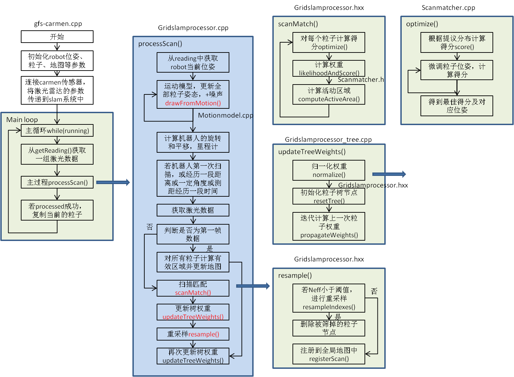

# GMAPPING-SLAM流程与函数详细说明

##  参考资料

### 理论参考网络资料

>  https://www.cnblogs.com/yhlx125/p/5634128.html

>  https://blog.csdn.net/roadseek_zw/article/details/53316177

>  https://blog.csdn.net/roadseek_zw/article/details/53316177

### 论文

>  Improved Techniques for Grid Mapping with Rao-Blackwellized Particle Filters.pdf

### 书

>  Probabilistic+Robotic


## 1. 总流程

gmapping的实现基于粒子滤波，利用30个粒子对位姿进行优化。每次扫描都要对所有的粒子用运动模型确定位姿，以及计算微调位姿的最优得分及最佳位姿。根据粒子权重的分布情况对粒子进行筛选，保留权重大的粒子。从而提高精度。




## 2. 数据类型

1. 位姿

   ```c++
   typedef orientedpoint<double, double> OrientedPoint;
   inline orientedpoint():point<T>(0,0), theta(0) {};
   ```

   包括坐标x, y和角度theta

2. 扫描光束

   ```c++
   class RangeReading:public SensorReading, public std::vector<double>{};
   ```

   是double类型的向量，存储扫描光束终端距离sensor的欧式距离。

3. 粒子向量

   ```c++
   typedef std::vector<Particle> ParticleVector;
   ```

   Particle结构包括参数：

   ```c++
   /** The map */
   ScanMatcherMap map;
   /** The pose of the robot */
   OrientedPoint pose;
   /** The pose of the robot at the previous time frame (used for computing thr odometry displacements) */
   OrientedPoint previousPose;
   /** The weight of the particle */
   double weight;
   /** The cumulative weight of the particle */
   double weightSum;
   double gweight;
   /** The index of the previous particle in the trajectory tree */
   int previousIndex;
   /** Entry to the trajectory tree */
   TNode* node;  
   ```

4. 节点

   节点用来将粒子构建成树类型。用于计算权重和筛选粒子。

   ```c++
   struct TNode{
   	/**Constructs a node of the trajectory tree.
   	@param pose:      the pose of the robot in the trajectory
   	@param weight:    the weight of the particle at that point in the trajectory
   	@param accWeight: the cumulative weight of the particle
   	@param parent:    the parent node in the tree
   	@param childs:    the number of childs
   	*/
   };
   ```

## 3. 数据来源及传输

××


## 4. 函数解析——drawFromMotion()

```c++
//arg1: 粒子的t-1时刻的位姿(p，const orientedpoint<T,A>)
//arg2: 当前t时刻的里程计读数(pnew，const orientedpoint<T,A>)
//arg3: t-1时刻的里程计读数(pold，const orientedpoint<T,A>)
//retn: 粒子的t时刻的位姿(p，const orientedpoint<T,A>)
```


1. 计算t时刻和t-1时刻的里程计的读数之差，并从世界坐标系拆分到t-1时刻robot坐标系中。

   ```c++
   orientedpoint<T,A> delta=p1-p2;
   
   delta.theta=atan2(sin(delta.theta), cos(delta.theta));
   
   double s=sin(p2.theta), c=cos(p2.theta);
   
   return orientedpoint<T,A>(c*delta.x+s*delta.y, -s*delta.x+c*delta.y, delta.theta);
   ```

   

2. 在里程计读数之差的基础上添加噪声，并归一化角度范围。

3. 将带噪声的里程计读数之差附加到t-1时刻的粒子位姿上，并将坐标系从粒子坐标系转换回世界坐标系，得到新的粒子位姿。

   ```c++
   double s=sin(p1.theta), c=cos(p1.theta);
   
   return orientedpoint<T,A>(c*p2.x-s*p2.y, s*p2.x+c*p2.y, p2.theta) + p1; 
   ```

   

4. 其他参数：

   ```c++
   double srr, str, srt, stt;
   //srr里程计的平移/平移  
   //srt里程计的平移/旋转  
   //stt里程计的旋转/旋转  
   //str里程计的旋转/平移
   //srr=0.01, srt=0.01, str=0.01, stt=0.01;
   double sxy=0.3*srr;
   //目测是两轮轴间耦合方差
   ```

## 5. 函数解析——scanMatch()

```c++
//scanMatch()扫描匹配获取最优的采样粒子。GMapping默认采用30个采样粒子。
//arg1: 粒子的t时刻的位姿，t时刻激光雷达扫描光束终端的距离信息(plainReading，const double*)
//retn: 更新了粒子的t时刻的权重(it->weight，double) 以及地图状态
```


对每个粒子：

- 对粒子进行微调，计算当前最佳位姿及得分。
-  计算粒子的权重。
-  计算地图的有效区域。

1. optimize()

   ```c++
   //optimize()计算得分最优的粒子
   //arg1: 位姿微调后的最佳位姿(corrected，const orientedpoint<T,A>)
   //arg2: 粒子的网格地图(map，const ScanMatcherMap)
   //arg3: 粒子的t时刻的位姿(init，const orientedpoint<T,A>)
   //arg4: 激光雷达扫描光束终端的距离信息(readings, const double*)
   //retn: 位姿微调后的最佳得分(bestScore, double)  
   ```

   

   调用了score()函数计算粒子得分。利用粒子的运动+score()中激光扫描观测数据。

   按照预先设定的步长前、后、左、右、左转、右转移动粒子的位置，分别根据提议分布计算得分，将得分最大的那个微调位姿作为粒子的新的位姿，将最大的得分作为粒子最佳得分。

   

2. score()

   ```c++
   //score()计算粒子得分
   //arg1: 粒子的网格地图(map，const ScanMatcherMap)
   //arg2: 粒子的t时刻的位姿(init，const orientedpoint<T,A>)
   //arg3: 激光雷达扫描光束终端的距离信息(readings, const double*)
   //retn: 粒子得分(currentScore, double)
   ```

   原理是likelihood_field_range_finder_model方法，参考《Probabilistic_Robotics》P172。

   

   

   公式(6.32)结合了两个部分：

   ```c++
   OrientedPoint lp=p;
   lp.x+=cos(p.theta)*m_laserPose.x-sin(p.theta)*m_laserPose.y;
   lp.y+=sin(p.theta)*m_laserPose.x+cos(p.theta)*m_laserPose.y;
   lp.theta+=m_laserPose.theta;
   ```

   1. 将激光雷达传感器相对于robot的位姿转换成激光雷达相对于世界坐标系的位姿。

      也就是考虑了激光雷达与robot之间的结构尺寸，而不是简单地认为两者在同一中心上。

      

      robot在世界坐标系中的坐标为lp=p。

      sensor在robot坐标系中的坐标为m_laserPose。

      上述转换将sensor从robot坐标系转换到世界坐标系中，包括平移和旋转。

      ```c++
      Point phit=lp;//计算障碍物坐标
      phit.x+=*r*cos(lp.theta+*angle);
      phit.y+=*r*sin(lp.theta+*angle);
      ```

   2. 将扫描光束相对于激光雷达的位姿转换成相对于世界坐标系的位姿。扫描光束相对于激光雷达有一个距离和夹角。

      

      sensor在世界坐标系中的坐标为lp。由坐标变换而来。

      激光光束在sensor坐标系中有两个信息，光束终端的距离r和相对sensor的偏转角angle。

      上述转换将光束终端从sensor坐标系转换到世界坐标系中。

      

      sensor在世界坐标系中的坐标为lp。由坐标变换而来。

      激光光束在sensor坐标系中有两个信息，光束终端的距离r和相对sensor的偏转角angle。

      取某一条光束的终端信息为例。转化成整数网格坐标phit(红色数据)

      根据定义的自由网格距离，计算该光束的远离障碍物的坐标，并计算增量pfree(绿色数据)

      在光束终端的整数坐标附近8邻域范围内，依次循环邻域的点pr。(浅蓝色网格8邻域)

      同时，对每个领域的坐标点pr计算pfree增量处的坐标点pf。pr和pf一一对应。(浅紫色网格)

      累加pr坐标和pf坐标，pr大于某一阈值，pf小于该阈值，且pr栅格的phit的平均坐标与phit的距离bestMu最小。（坐标点的乘积=x*x+y*y）

      得分计算： s +=exp(-1.0/m_gaussianSigma*bestMu*besMu)  参考NDT算法：距离越大，分数越小，分数的较大值集中在距离最小值处，符合正态分布模型

      

3. likelihoodAndScore()


