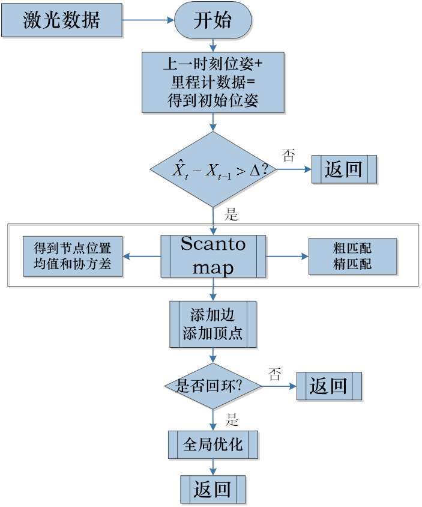
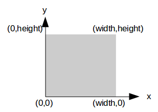

# Karto SLAM代码解析

> K. Konolige, G. Grisetti, R. K¨ummerle, B. Limketkai, R. Vincent, Efficient Sparse Pose Adjustment for 2D Mapping, In Proc. of Int. Conf. on Intelligent Robots and Systems (IROS), Oct. 2010.

## 1. 概况

特征：

- Multi-Search
- Scan-Match：扫描匹配，点云与局部相关地图之间的匹配
- Loop-Closure：闭环检测
- SPA/G2O：图优化算法
- Pose-Map：位姿图，需要根据激光数据和校正后的位姿另外建图


上图是对Karto SLAM的整体框架的介绍。从2016年SLAM的大综述中可以看到，这其实就是一般SLAM的一个基本框架，这里指的是带优化的框架。作者2010的论文正是图优化刚开始涌入至SLAM的体现。

Karto SLAM基于图优化的思想，用高度优化和非迭代 Cholesky分解进行稀疏系统解耦作为解。图优化方法利用图的均值表示地图，每个节点表示机器人轨迹的一个位置点和传感器测量数据集，每个新节点加入，就会进行计算更新。

Karto SLAM的ROS版本，其中采用的稀疏点调整（the Spare Pose Adjustment(SPA)）与扫描匹配和闭环检测相关。**Landmark越多，内存需求越大**，然而==图优化方式相比其他方法在大环境下制图优势更大，因为他仅包含点的图(robot pose)，得到优化后的位姿后再建立地图Map==。



## 2. 基础类解析

代码中所有的配置参数都以封装成类，调用的时候取值`GetValue()`。

### 顶点和边

#### 顶点-Vertex

Karto SLAM中，顶点类模板`Vertex<T>`的实例是`Vertex<LocalizedRangeScan>`，指的是包含机器位姿等信息的一帧激光数据。

```c++
std::vector<Edge<T>*> m_Edges;
```

该顶点将会添加与该顶点相连的边`edge`的信息。从而根据相连的边的信息得到相邻的其他顶点的信息。

#### 边-Edge

边指的是（`sensorPose`还是`robotPose`？）之间的约束关系。

```c++
Vertex<T>* m_pSource; // 边的起点顶点
Vertex<T>* m_pTarget; // 边的终点顶点
EdgeLabel* m_pLabel; // 边的标签信息
```

一条边记录的这条边连接的两个顶点的所有信息。

### 激光数据

类`LocalizedRangeScan`创建激光点云，包含激光点云的所有距离值，以及多个位姿。

```c++
Pose2 m_OdometricPose; // 里程计表示的机器位姿
Pose2 m_CorrectedPose; // 被图优化后的机器位姿（若没有优化，数值同里程计位姿）

Pose2 m_BarycenterPose; // 所有激光测距的质心表示的机器位姿

PointVectorDouble m_PointReadings; // 过滤后的激光点云的终端的世界坐标集
PointVectorDouble m_UnfilteredPointReadings; // 未过滤的激光点云的终端的世界坐标集
BoundingBox2 m_BoundingBox; // 过滤后的激光点云的终端的世界坐标集的最大范围框

kt_bool m_IsDirty; // 更新上述信息的标识位
```

这里说的里程计位姿、校正后的位姿等都是指机器位姿，而`scanPose`或者`sensorPose`指的是传感器位姿，两者之间由传感器相对机器的偏移位姿`offsetPose`关联起来。在作坐标转换时，经常要考虑当前位姿是说传感器位姿还是机器位姿，并做相应的偏移处理。

### 查表

`GridIndexLookup`类创建一个按照角度分辨率分布的激光点云查找表。该查找表的第一维按照角度分辨率`angleResolution`和角度偏移值`angleOffset`划分`nAngles`个查找表。

```c++
kt_int32u nAngles = static_cast<kt_int32u>(math::Round(angleOffset * 2.0 / angleResolution) + 1);
```

| angle\index |  point1  |  point2  | $\cdots$ |  pointN  |
| :---------: | :------: | :------: | :------: | :------: |
| startAngle  | index11  | index12  | $\cdots$ | index1N  |
|  $\vdots$   | $\vdots$ | $\vdots$ | $\cdots$ | $\vdots$ |
| angleCenter | indexP1  |  indeP2  | $\cdots$ | indexPN  |
|  $\vdots$   |  \vdots  | $\vdots$ | $\cdots$ | $\vdots$ |
|  endAngle   | indexQ1  | indexQ2  | $\cdots$ | indexQN  |

根据角度中心值`angleCenter`和角度偏移值`angleOffset`得到起始角度`startAngle`，按照`nAngles`个离散角度增量进行循环，最后的终止角度表示为`endAngle`：

```c++
kt_double angle = 0.0;
kt_double startAngle = angleCenter - angleOffset;
for (kt_int32u angleIndex = 0; angleIndex < nAngles; angleIndex++)
{
    angle = startAngle + angleIndex * angleResolution;
    ComputeOffsets(angleIndex, angle, localPoints, pScan);
} // endAngle = angleCenter + angleOffset
```

查找表的第二维记录了旋转后的激光点云的地图坐标。在每个角度值处，将原始的激光点云按照当前角度值进行旋转，得到旋转后的点云世界坐标，并将该世界坐标转换到地图坐标中，记录地图坐标序号到查找表中，得到这个角度处的旋转后的激光点云地图坐标序号的查找表。


### 地图

#### Grid类和CoordinateConverter类

`Grid`类创建地图，根据输入`width`和`height`以及分辨率`resolution`创建一个局部网格地图。其中地图的`width`值经过了8bit对齐后是`m_widthStep`。

初始化地图网格的数据都是0。起点在左下角，网格坐标为(0,0)。

```c++
kt_int32s m_Width;       // width of grid
kt_int32s m_Height;      // height of grid
kt_int32s m_WidthStep;   // 8 bit aligned width of grid
T* m_pData;              // grid data

// coordinate converter to convert between world coordinates and grid coordinates
CoordinateConverter* m_pCoordinateConverter;
```


`Grid`类只记录宽、高和网格数据。另外有一个专门用于转换世界坐标系和地图坐标系的类`CoordinateConverter`用于记录该地图与世界坐标系的转换参数，如缩放系数`m_scale`(即分辨率倒数`1.0/resolution`)、偏移`m_Offset`，等。

```c++
Size2<kt_int32s> m_Size; // width * height
kt_double m_Scale;       // 1.0 / resolution

Vector2<kt_double> m_Offset; // 局部地图的偏移量
```

上述两个类相互依赖，包含了世界坐标转换地图序号Index、地图序号Index转换世界坐标等各类坐标转换接口。

此外，`Grid`类有一个光束轨迹累积函数，方法同`Bresenham`算法一样，用于将光束覆盖的网格的数值增加一个常量。

```c++
void TraceLine(kt_int32s x0, kt_int32s y0, kt_int32s x1, kt_int32s y1, Functor* f = NULL)
{
    kt_bool steep = abs(y1 - y0) > abs(x1 - x0);
    if (steep)
    {
        std::swap(x0, y0);
        std::swap(x1, y1);
    }
    if (x0 > x1)
    {
        std::swap(x0, x1);
        std::swap(y0, y1);
    }

    kt_int32s deltaX = x1 - x0;
    kt_int32s deltaY = abs(y1 - y0);
    kt_int32s error = 0;
    kt_int32s ystep;
    kt_int32s y = y0;

    if (y0 < y1)
    {
        ystep = 1;
    }
    else
    {
        ystep = -1;
    }

    kt_int32s pointX;
    kt_int32s pointY;
    for (kt_int32s x = x0; x <= x1; x++)
    {
        if (steep)
        {
            pointX = y;
            pointY = x;
        }
        else
        {
            pointX = x;
            pointY = y;
        }

        error += deltaY;

        if (2 * error >= deltaX)
        {
            y += ystep;
            error -= deltaX;
        }

        Vector2<kt_int32s> gridIndex(pointX, pointY);
        if (IsValidGridIndex(gridIndex))
        {
            kt_int32s index = GridIndex(gridIndex, false);
            T* pGridPointer = GetDataPointer();
            pGridPointer[index]++;

            if (f != NULL)
            {
                (*f)(index);
            }
        }
    }
}
```

#### CorrelationGrid类

该`CorrelationGrid`类用于扫描匹配前建立局部相关地图。与`Grid`类相比，`CorrelationGrid`类对原始地图进行了边缘扩充`2×borderSize`，便于根据平滑偏差`m_SmearDeviation`使用核函数`m_pKernel`进行平滑。

```c++
kt_double m_SmearDeviation; // 平滑偏差

// Size of one side of the kernel
kt_int32s m_KernelSize; // 核边长

// Cached kernel for smearing
kt_int8u* m_pKernel; // 核数组

// region of interest
Rectangle2<kt_int32s> m_Roi;
```

说明一下感兴趣区域`ROI`。该区域实际代表的是原始网格地图的范围，在此基础上，边缘扩充了一半核窗口`halfKernelSize+1`大小，以防对边缘网格进行平滑时数组溢出。扩充后的地图如下图所示。中间区域就是感兴趣区域。




说明一下核。在`CorrelationGrid`类中，允许对网格地图进行平滑，平滑参数为`m_SmearDeviation`，由平滑参数和分辨率一起得到核窗口的边长`m_KernelSize`：

```c++
// 获得核窗口边长的一半
static kt_int32s GetHalfKernelSize(kt_double smearDeviation, kt_double resolution)
{
    assert(resolution != 0.0);

    return static_cast<kt_int32s>(math::Round(2.0 * smearDeviation / resolution));
}
// 获得核窗口边长，+1确保是奇数，有中心网格
m_KernelSize = 2 * GetHalfKernelSize(m_SmearDeviation, resolution) + 1;
```

进而得到核数组`m_pKernel`：

```c++
m_pKernel = new kt_int8u[m_KernelSize * m_KernelSize];
```

核数组的数值根据高斯分布来计算：

```c++
kt_int32s halfKernel = m_KernelSize / 2;
for (kt_int32s i = -halfKernel; i <= halfKernel; i++)
{
    for (kt_int32s j = -halfKernel; j <= halfKernel; j++)
    {
        kt_double distanceFromMean = hypot(i * resolution, j * resolution);
        kt_double z = exp(-0.5 * pow(distanceFromMean / m_SmearDeviation, 2));

        kt_int32u kernelValue = static_cast<kt_int32u>(math::Round(z * GridStates_Occupied));
        assert(math::IsUpTo(kernelValue, static_cast<kt_int32u>(255)));

        int kernelArrayIndex = (i + halfKernel) + m_KernelSize * (j + halfKernel);
        m_pKernel[kernelArrayIndex] = static_cast<kt_int8u>(kernelValue);
    }
}
```

举个例子：

令平滑参数`smearDeviation = 0.03`，分辨率`resolution = 0.05`。则核边长为`kernelSize = 2×(int)(2×0.03/0.05)+1 = 3`。一半核边长为`halfKernel = 1`。剩余的核数值见图：


将核应用于地图平滑，是指如果某个给定网格点为障碍物，则在以该点为中心的核窗口中，一一比较窗口中的格子的地图值和核数值，如果核数值大于地图值，则将核数值复制给地图的对应格子，达到平滑的效果。

```c++
inline void SmearPoint(const Vector2<kt_int32s>& rGridPoint)
{
    assert(m_pKernel != NULL);

    int gridIndex = GridIndex(rGridPoint);
    if (GetDataPointer()[gridIndex] != GridStates_Occupied)
    {
        return;
    }

    kt_int32s halfKernel = m_KernelSize / 2;

    // apply kernel
    for (kt_int32s j = -halfKernel; j <= halfKernel; j++)
    {
        kt_int8u* pGridAdr = GetDataPointer(Vector2<kt_int32s>(rGridPoint.GetX(), rGridPoint.GetY() + j));

        kt_int32s kernelConstant = (halfKernel) + m_KernelSize * (j + halfKernel);

        // if a point is on the edge of the grid, there is no problem
        // with running over the edge of allowable memory, because
        // the grid has margins to compensate for the kernel size
        for (kt_int32s i = -halfKernel; i <= halfKernel; i++)
        {
            kt_int32s kernelArrayIndex = i + kernelConstant;

            kt_int8u kernelValue = m_pKernel[kernelArrayIndex];
            if (kernelValue > pGridAdr[i])
            {
                // kernel value is greater, so set it to kernel value
                pGridAdr[i] = kernelValue;
            }
        }
    }
}
```


#### OccupancyGrid类

该`OccupancyGrid`类用于追迹光束，统计光束通过某个网格的次数或者光束终端落在某个网格的次数，根据两者的比例更新网格地图的障碍物关系。

```c++
//Counters of number of times a beam passed through a cell
Grid<kt_int32u>* m_pCellPassCnt; // 用另一个Grid类来统计光束通过网格的次数

//Counters of number of times a beam ended at a cell
Grid<kt_int32u>* m_pCellHitsCnt; // 用另一个Grid类来统计光束终端落于网格的次数

CellUpdater* m_pCellUpdater; // ？？

////////////////////////////////////////////////////////////
// NOTE: These two values are dependent on the resolution.  If the resolution is too small, then not many beams will hit the cell!

// Number of beams that must pass through a cell before it will be considered to be occupied or unoccupied.  This prevents stray beams from messing up the map. 直到一定数量的光束通过了该网格，再考虑该网格是障碍物还是空闲区域，防止杂散光涂抹地图
Parameter<kt_int32u>* m_pMinPassThrough;

// Minimum ratio of beams hitting cell to beams passing through cell for cell to be marked as occupied
Parameter<kt_double>* m_pOccupancyThreshold;
```

通过`RayTrace()`函数，并内部调用直线转换为网格的`Bresenham`算法，将光束通过的网格`m_pCellPassCnt`的数值+1，对有效光束终端，同时将光束终端所在的网格`m_pCellPassCnt`和`m_pCellHitsCnt`的数值+1。如此，将世界坐标系下光束的分布转换到两个网格地图中网格的访问次数中，进而用于网格地图的更新。


继上述光束追迹之后，根据光束通过网格`m_pCellPassCnt`和光束终端网格`m_pCellHitsCnt`的数据，遍历整个网格地图，对每一个网格，首先判断该网格的光束通过次数是否达到阈值，避免杂散光对地图的涂抹。满足上述条件后，再比较光束终端次数和光束通过次数的比例，满足一定阈值则认为该网格是障碍物，反之，该网格是空闲区域。

通过`AddScan()`函数，将包含距离和终点坐标信息的激光点云依次插入到网格地图中。激光点云的距离如果超出最大最小范围，则跳过该光束；激光点云的距离如果超出阈值，则认为光束终端不可靠，不计入地图中，并且将光束范围重置到有效范围内，再插入地图中。

## 3. 代码流程解析

### 入口流程

入口主函数在`slam_karto`中。进入`main()`函数后，创建了`SlamKarto`类。


在`laserCallback()`中，从`msg`中拿到了一帧激光数据和**传感器相对于机器的位姿**，进入`kartoSLAM`并更新地图。


在获取激光雷达帧时，从`msg`中得到了激光雷达的参数信息，包括：传感器相对于机器的偏移位姿、距离最大最小范围、角度最大最小范围、角度分辨率等。


在`addScan()`中，首先通过`getOdomPose()`函数从`msg`中获取里程计估计的机器位姿；然后创建`LocalizedRangeScan`激光数据类，设置这一帧激光数据的里程计估计的机器位姿，和校正后的机器位姿（**由于当前并未经过图优化校正，该位姿初始值与里程计位姿相同**）。随后进入`kartoSLAM`重要的处理过程。如果处理成功，则获取优化后的当前机器位姿。


### 主要处理流程

上述入口流程完成了数据获取和处理的流程分析。现在进入匹配和图优化处理的流程分析。在获取一帧激光数据，以及相应的里程计位姿后，就可以进入`Process()`中进行匹配和校正位姿。


首先，跳过无效帧的处理。

第二步，判断`Mapper`类的成员变量是否经过初始化。需要初始化的成员变量如下：

```c++
// 连续扫描匹配器--用于扫描匹配
ScanMatcher* m_pSequentialScanMatcher;
// 用于记录传感器数据，激光点云和各种位姿
MapperSensorManager* m_pMapperSensorManager;
// 用于图优化
MapperGraph* m_pGraph;
```

其中，`ScanMatcher`类的构造需要几个参数，来自`Mapper`类的加载参数，如下：

```c++
/**
 * The size of the search grid used by the matcher. 匹配时搜索的网格范围
 * Default value is 0.3 meters which tells the matcher to use a 30cm x 30cm grid.
 */
Parameter<kt_double>* m_pCorrelationSearchSpaceDimension;

/**
 * The resolution (size of a grid cell) of the correlation grid. 相关网格的分辨率
 * Default value is 0.01 meters.
 */
Parameter<kt_double>* m_pCorrelationSearchSpaceResolution;

/**
 * The point readings are smeared by this value in X and Y to create a smoother response. 平滑地图的范围
 * Default value is 0.03 meters.
 */
Parameter<kt_double>* m_pCorrelationSearchSpaceSmearDeviation;
```

`MapperSensorManager`类的构造需要几个参数，来自`Mapper`类的加载参数，如下：

```c++
/**
 * Scan buffer size is the length of the scan chain stored for scan matching. 记录激光数据的最大数量
 * "scanBufferSize" should be set to approximately "scanBufferMaximumScanDistance" / "minimumTravelDistance".
 * The idea is to get an area approximately 20 meters long for scan matching.
 * For example, if we add scans every minimumTravelDistance == 0.3 meters, then "scanBufferSize"
 * should be 20 / 0.3 = 67.)
 * Default value is 67.
 */
Parameter<kt_int32u>* m_pScanBufferSize;

/**
 * Scan buffer maximum scan distance is the maximum distance between the first and last scans 记录激光数据的最长距离
 * in the scan chain stored for matching.
 * Default value is 20.0.
 */
Parameter<kt_double>* m_pScanBufferMaximumScanDistance;
```

第三步，获取上一帧激光数据。如果不存在上一帧激光数据，说明当前激光数据是第一帧。

第四步，如果存在上一帧激光数据，则获取其中记录的从原始里程计位姿到优化校正后的位姿之间的变换位姿。并用该变换位姿初步校正当前帧的里程计位姿。这一步初步校正不一定存在，如果上一帧激光数据并没有经过图优化，则变换位姿为`(0,0,0)`。

第五步，判断机器在获取当前帧激光数据时是否已经走过一段距离或者旋转了一定角度。针对第一帧激光数据则该判断结果为`true`，针对其他帧激光数据，判断条件包含三个：经过一定的时间，旋转了一定的角度，移动了一定的范围。满足以上任一条件则判断结果为`true`，反之判断结果为`false`。该判断降低了激光数据的处理频率，避免环境没有发生明显变化导致的冗余计算。

第六步，进行扫描匹配。首先根据参数和上一帧激光数据是否存在来判断是否可以进行扫描匹配。第一帧激光数据由于缺少参考激光数据，无法进行扫描匹配。非第一帧激光数据的参考激光数据是一串连续的过去的激光数据，存储为`m_RunningScans`，其中保存了从上一帧开始的与上一帧距离在一定范围内的所有激光数据。随着机器位置的变化，该激光数据串也在不断更新，保存最新的激光数据，删除旧的激光数据。`MatchScan()`扫描匹配的详细介绍放在[扫描匹配](#扫描匹配)中。扫描匹配后将更新该帧的传感器位姿。

第七步，`AddScan()`存储当前激光数据。分别存储到`MapperSensorManager`类和`ScanMatcher`类中，并给激光数据加上ID。

第八步，如果允许进行扫描匹配，则给图添加顶点和边，给`m_RunningScans`添加当前帧激光数据，判断是否进行闭环优化。给图添加顶点和边的详细介绍放在[图添加顶点和边](#图添加顶点和边)中。闭环检测及优化的详细介绍放在[回环检测及优化](#回环检测及优化)中。

最后一步，将当前激光数据更新为`lastScan`。

### 扫描匹配

#### MatchScan()

匹配的过程的入口。设置好匹配的范围以及匹配参数，调用`CorrelateScan()`进行匹配，返回匹配率，位姿均值和协方差矩阵。根据参数不同，分为粗匹配和精匹配。


如果当前帧点云的点数为零，则使用里程计的位姿作为匹配后的位姿，返回默认协方差矩阵。

将感兴趣区域地图中心移到当前点云区域。

在添加点云之前，重置局部地图`m_pCorrelationGrid->Clear()`。`AddScans()`插入上一步筛选出的周围临近备选激光点云，到局部地图中，将点云终端的位置转换到世界坐标系下，并将地图`Grid`在该点的属性更新为`Occ`。

#### CorrelateScan()

当前激光数据帧与局部相关地图的匹配过程。局部相关地图已经在`MatchScan()`阶段完成了更新。在`CorrelateScan()`阶段则根据给定分辨率通过位移和角度偏移进行扫描匹配。记录每一种位姿下获得的匹配响应结果，累积匹配响应结果最大的位姿，取平均值得到最佳位姿和最优匹配响应结果，再计算协方差矩阵。


`GetResponse()`是把所有输入角度对应的`LookupArray`中的网格序号对应的局部相关地图的状态累积，并取平均值作为匹配响应结果。

`ComputePositionalCovariance()`和`ComputeAngularCovariance()`分别计算了位姿协方差和角度协方差，过程尚未详细看。

### 图添加顶点和边

#### AddVertex()-AddNode()

图中添加顶点，对于Karto SLAM来说，顶点就是一帧激光数据，其中包含了一组对应的位姿。对于SPA优化来说，顶点也就是节点，就是该激光数据的匹配后的位姿。


#### AddEdge()

该接口输入两帧激光数据，转换成图中对应的两个顶点`vSource`和`vTarget`，表示起点顶点和终点顶点。然后获取起点顶点`vSource`的关联的边，遍历每条边，如果边的终点顶点与`vTarget`相同，表示查找到已经存在的边，返回该边。如果没有找到，则根据两个顶点创建新的边，将新的边分别添加到两个顶点中，并将新的边添加到图中。


下图坐标是找到已经存在的边，右边是添加新的边。


#### AddEdges()

图中添加边，对于Karto SLAM来说，边的关系来自激光数据帧之间的相对位姿和协方差矩阵。当传感器仅有第一帧激光数据时，将从其他传感器中获取激光数据帧，进行匹配和关联，保留匹配率较高的位姿和协方差矩阵信息。当传感器有两帧以上的激光数据时，首先关联上一帧激光数据，进而关联`runningScans`一串连续的激光数据帧。此外，还需要关联邻近的链条。最后将所有位姿和协方差矩阵求平均，计算当前帧的传感器位姿。


#### LinkScans()-AddConstraint()

该接口实现了对输入的两帧激光数据以及后一帧的位姿和协方差矩阵，查找是否存在相连的边，如果不存在，则创建新的边，并将边的信息（相对位姿和协方差矩阵）存储到图中，用于SPA优化。


#### LinkChainToScan()

该接口实现了对输入的一串激光数据帧和当前激光数据帧以及后一帧的位姿和协方差，从激光数据帧链中寻找距离当前帧最近的一帧激光数据，并对最近的这两帧激光数据进行上述的`LinkScans()`添加边的信息。

这里的最近比较的是两帧激光数据的`referencePose`之间的距离。


#### LinkNearChains()

该接口实现了对输入的一帧激光数据以及位姿和协方差，寻找附近的激光数据链，对每条激光数据链，首先进行`MatchScan()`局部地图匹配，如果匹配结果较好，则进行上述的`LinkChainToScan()`从激光数据链与当前激光数据帧中寻找边的信息。


`FindNearChains()`接口实现了寻找邻近的激光数据链功能。首先通过`FindNearLinkedScans()`找到与输入帧相连的所有激光数据帧，遍历相连的激光数据帧，对每一帧激光数据，根据ID序号先依次递减，遍历当前帧以前的激光数据，根据位姿之间距离的远近，选择保留或者舍弃该激光数据到当前激光数据链中，超出距离范围后，结束当前遍历。一旦在遍历过程中找到输入帧，则认为该激光数据链无效。

完成根据ID序号依次递减的遍历后，将当前激光数据添加到当前激光数据链中。

再根据ID序号依次递增，遍历当前帧以后的激光数据，同样根据位姿之间的距离的远近，旋转保留或者舍弃该激光数据到当前激光数据链中，超出距离范围后，结束当前遍历。一旦在遍历过程中找到输入帧，则认为该激光数据链无效。

在一次外部遍历过程中，一旦认为该激光数据链有效，则存储当前激光数据链。

最后返回所有的有效激光数据链。

**每条激光数据链来自于以某一帧相邻的激光数据为中点，根据ID大小递减和递增后，在一定相对位移范围内的所有激光数据组成。**


### 回环检测及优化

#### 闭环检测-TryCloseLoop()

重要的闭环检测入口，反复调用`FindPossibleLoopClosure()`寻找备选激光数据链，调用`MatchScan()`进行粗匹配，根据粗匹配结果决定是否进行精匹配，根据精匹配结果决定是否进行优化`LinkChainToScan()`和`CorrectPoses()`。


**输入：**

```c++
LocalizedRangeScan* pScan // 一帧点云
const Name& rSensorName // 传感器名字
```

**输出：**

```c++
loopClosed = true or false // 是否闭环优化
```

#### 闭环检测-FindPossibleLoopClosure()

该接口实现了寻找可能闭环的激光数据链功能。首先找到输入激光数据帧的一定位移范围内的所有相邻激光数据帧。在后续的寻找可能闭环的激光数据链的过程中，要剔除相邻激光数据帧。从`rStartNum`开始遍历所有的过去的激光数据帧，如果位移在一定范围内，并且不属于相邻帧，则将该帧添加到备选链中。如果属于相邻帧，则清空当前备选链，继续遍历下一帧。如果位移超过一定的范围，并且当前备选链大小达到阈值，则返回当前备选链，以及对应的遍历到当前帧的序号，便于下一次寻找可能闭环时继续遍历。如果位移超过一定的范围，且备选链大小小于阈值，则清空备选链，继续遍历下一帧。


`GetReferencePose()`根据输入参数返回位姿，如果使用质心，则返回这一帧激光点云的质心位置；反之，返回传感器在世界坐标系下的位姿。

`FindNearLinkedScans()`根据输入的激光点云和距离参数，寻找该距离范围内的其他激光点云。下面对该查找方法进行说明。深度遍历方法。首先从起点顶点开始遍历与之相连的其他顶点，记录满足一定范围的顶点，接着以范围内的其他某个顶点为起点，遍历与该顶点相连的其他顶点，记录满足范围的顶点。不断扩充遍历范围。

**输入：**

```c++
LocalizedRangeScan* pScan // 当前激光点云
kt_double maxDistance // 最大搜索范围
```

**输出：**

```c++
LocalizedRangeScanVector nearLinkedScans // 范围内的所有激光点云的集合链
```

**理论：**

(0) 将当前scan作为起始顶点，记录到将要访问的顶点队列`toVisit`和已经访问过的顶点集`seenVertices`中

(1) 以将要访问的顶点队列`toVisit`的第一个顶点作为本次循环的起始顶点`pNext`

(2) 根据预先设定的最大可接受范围，判断该顶点在最大可接受范围内`Visit()`。true->(3)，false->(1)

(3) 将当前顶点`pNext`添加到有效顶点数组`validVertices`中，遍历所有顶点，添加除去当前顶点的其他顶点到相邻顶点集`adjacentVertices`中

(4) 遍历相邻顶点集`adjacentVertices`，将其中未访问过的顶点（不在`seenVertices`集合中）添加到将要访问的顶点队列`toVisit`和已经访问过的顶点集`seenVertices`中


（第一次循环将除去起始顶点外的其他所有顶点都添加到`toVisit.size()==7`集合和`seenVertices.size()==7`集合中了，有效顶点集合中有起始顶点一个`validVertices.size()==1`）

接下来重复(1) - (4)步骤：

(1) 以将要访问的顶点队列`toVisit`的第一个顶点作为本次循环的起始顶点`pNext`

(2) 根据预先设定的最大可接受范围，判断该顶点在最大可接受范围内`Visit()`。true->(3)，false->(1)

(3) 将当前顶点`pNext`添加到有效顶点数组`validVertices`中，遍历所有顶点，添加除去当前顶点的其他顶点到相邻顶点集`adjacentVertices`中

(4) 遍历相邻顶点集`adjacentVertices`，将其中未访问过的顶点（不在`seenVertices`集合中）添加到将要访问的顶点队列`toVisit`和已经访问过的顶点集`seenVertices`中


(第一次循环后，由于所有顶点都已经添加到`seenVertices`集合中了，第二次循环时`toVisit.size()==6`和`seenVertices.size()==7`集合的数量没有增加，每循环一次，`toVisit`集合的数量就减少一个，`validVertices`的数量仅在满足距离条件时增加)


本例的最终效果：


最终得到了由满足距离条件的所有激光点云形成的集合。

#### SPA优化-CorrectPoses()

重要的优化入口，调用`Compute()`对已经添加的节点和约束进行SPA优化，调用`GetCorrections()`返回优化后的结果，并将优化后的位姿赋值`SetSensorPose(pose)`给对应的激光点云帧`GetScan(ID)`上，替换原始位姿。


#### SPA优化-Compute()

优化求解的过程调用了`sparse_bundle_adjustment`库的`doSPA()`接口。获取优化后的结果调用了`getNodes()`接口，转换成`vector<pair<ID, pose>>`形式的输出结果。


**参数：**

```c++
typedef std::vector<std::pair<kt_int32s, Pose2>> IdPoseVector;
karto::ScanSolver::IdPoseVector corrections;
```

**输出：**

```c++
vector<pair<ID, pose>>一一对应的位姿集合。
```

**理论：**

整个优化算法使用了LM优化算法。

观测量：
$$
h(c_i,c_j)=\begin{bmatrix} 
R^T_i(t_j-t_i) \\ \theta_j-\theta_i
\end{bmatrix}
$$
优化代价函数：
$$
\begin{split}
e_{ij} &= z_{ij}-h(c_i,c_j) \\
\chi^2 &= \sum \limits_{ij} e^T_{ij}\Lambda_{ij}e_{ij}
\end{split}
$$

其中，信息矩阵$\Lambda$表示为：
$$
\lambda=\begin{bmatrix}
\Lambda_{ab} & & \\ & \ddots & \\ & & \Lambda_{mn}
\end{bmatrix}
$$
代价函数的雅可比矩阵为：
$$
\begin{split}
\frac{\partial e_{ij}}{\partial t_i} &= \begin{bmatrix} 
-R^T_i \\ 0 \; 0 \end{bmatrix} \\
\frac{\partial e_{ij}}{\partial \theta_i} &= \begin{bmatrix}
-\frac{\partial R^T_i}{\partial \theta_i}(t_j-t_i) \\ -1
\end{bmatrix}
\end{split}
$$
LM系统方程：
$$
({\rm H}+\lambda diag {\rm H})\Delta x={\rm J}^T{\Lambda}{\rm e}
$$
其中，${\rm J}=\frac{\partial {\rm e}}{\partial {\rm x}},{\rm H}={\rm J}^T{\rm \Lambda}{\rm J}$。

更新方程为：
$$
\begin{split} 
t_i &= t_i + \Delta t_i \\
\theta_i &= \theta_i + \Delta \theta_i
\end{split}
$$


### 建图

只保存了位姿节点和激光数据，作为pose_graph。

