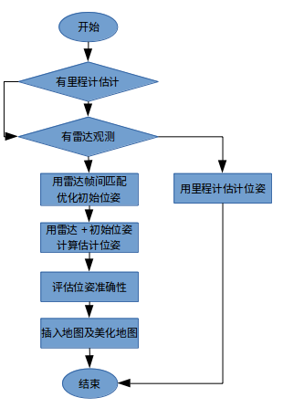
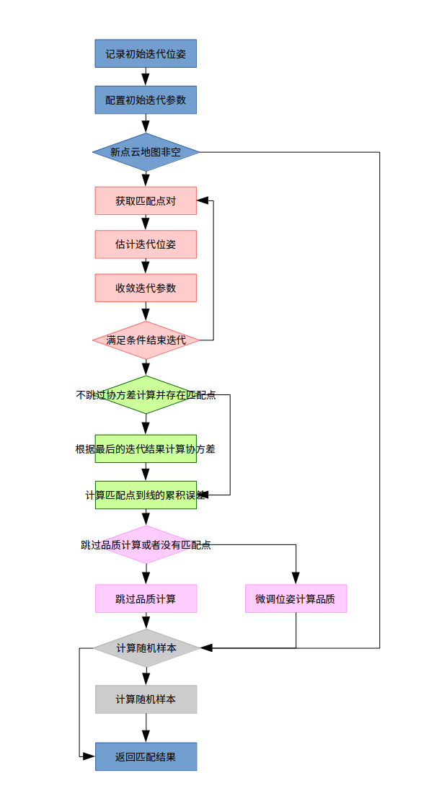
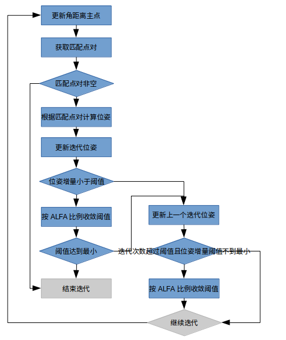
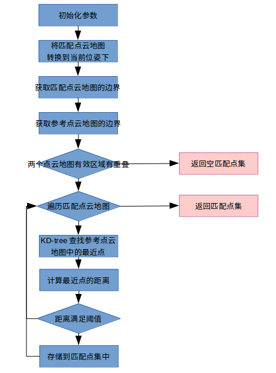

# ICP算法之应用

ICP-SLAM算法的应用程序在CMetricMapBuilderICP类中，包含了slam初始化，slam处理，地图的加载和保存，路径的加载和保存等操作。

## ICP-SLAM应用程序的配置参数

```c++
struct SLAM_IMPEXP TConfigParams : public mrpt::utils::CLoadableOptions {
	/** Initializer */
	TConfigParams(mrpt::utils::VerbosityLevel &parent_verbosity_level);
	TConfigParams &operator=(const TConfigParams &other);  //Copy assignment

    void loadFromConfigFile(const mrpt::utils::CConfigFileBase &source, const std::string &section) MRPT_OVERRIDE; //从配置文件读取配置参数
	void dumpToTextStream(mrpt::utils::CStream &out) const MRPT_OVERRIDE; //打印配置参数

	bool matchAgainstTheGrid;//1=参考地图为网格地图，快速但精度低；0(默认)=参考地图为点云地图
	
    //机器人位姿没有发生明显变化，对地图的变化影响很小，就不更新地图，节约运行时间
    double insertionLinDistance;//可将新的观测值插入地图的机器人位姿的距离增量下限
    double insertionAngDistance;//可将新的观测值插入地图的机器人位姿的角度增量下限
     
    //机器人位姿没有发生明显变化，就不进行ICP，节约运行时间
    double localizationLinDistance;//可将新的观测值用于ICP的机器人位姿的距离增量下限
    double localizationAngDistance;//可将新的观测值用于ICP的机器人位姿的角度增量下限

    double minICPgoodnessToAccept;//能够接受的最小ICP匹配率(默认0.4) 
    double maxSqrDistToAccept;//能够接受的最大平方误差
    double maxlikelihoodDiff;//能够接受的最大似然差
    double maxMapOutEdgeRatioToAccept;//能够接收的最大地图超出边界的比例
    
    mrpt::utils::VerbosityLevel &verbosity_level;

	mrpt::maps::TSetOfMetricMapInitializers mapInitializers;//用于创建地图，地图参数来自配置文件，至少创建1个点云地图和/或1个网格地图
};

TConfigParams ICP_options; //用于配置ICP-SLAM应用程序的参数
```

以上参数主要用于约束观测值进行ICP-SLAM，以及观测值插入地图的行为。由于将观测值插入地图的过程十分耗时，当机器人位姿增量在很小的范围内，认为对地图的更新没有较大变化，可以跳过本次更新，直到机器人位姿增量达到一定的数值，再更新地图，提高运行速度。

在实际测试过程中，观察到当机器人位于规则场景的中央位置，比如正方形或者长方形，或者其他规则场景中，ICP算法会得到一个匹配率较低的结果，同时满足了地图更新条件，但位姿的估计其实是错误的，这时候地图更新就造成了建图错图。

这种情况在雷达频率较低的情况下比较容易发生。每两次SLAM的间隔时间较长，一旦里程计提供的估计位姿误差较大，导致待匹配点云和参考点云之间有较大的位姿差别，ICP-SLAM在迭代范围内达到局部匹配率最大值，就认为完成了匹配。实际上两个点云可能相差了90deg。


**在SLAM应用程序中，有两个跳过判断条件：**

- 满足条件则跳过本次ICP-SLAM
- 满足条件则跳过本次地图更新

两者的目的都是在位姿变化很小时，跳过处理过程，节约运行时间。

**跳过本次ICP-SLAM的判断条件：**

- 观测值有里程计
- 且，里程计的位姿增量估计小于阈值（即位姿变化很小）

```c++
const bool we_skip_ICP_pose_correction =
	m_there_has_been_an_odometry &&
	m_distSinceLastICP.lin < std::min(ICP_options.localizationLinDistance, ICP_options.insertionLinDistance) && 
    m_distSinceLastICP.ang < std::min(ICP_options.localizationAngDistance, ICP_options.insertionAngDistance);
```

**进行本次地图更新的判断条件：**

- 第一次使用该传感器
- 或，（（不可进行ICP）&&（机器人的位姿增量在阈值范围内））
- 或，（（ICP匹配率大于阈值）&&（机器人的位姿增量在阈值范围内））

```c++
bool update = firstTimeForThisSensor ||
    ( (!can_do_icp || m_isAcceptedPose) &&
     ( m_distSinceLastInsertion[obs->sensorLabel].lin >= ICP_options.insertionLinDistance ||
      m_distSinceLastInsertion[obs->sensorLabel].ang >= ICP_options.insertionAngDistance ) );
```

## ICP-SLAM应用程序流程



里程计用来做初始位姿估计以及更新SLAM中的有关里程计的辅助参数。雷达用来进行ICP匹配，以及更新地图。

上述流程对原始ICP-SLAM进行了修改，在里程计估计位姿输出之前，利用帧间匹配对里程计估计位姿进行优化，目前的处理流程为：


**mrpt的ICP算法分为两种：**

- 经典ICP：icpClassic
- LM-ICP：icpLevenbergMarquardt

通过配置文件实现算法类型的选择。


# CLASSIC-ICP算法

算法实现在CICP.cpp中：

```c++
CPosePDFPtr CICP::ICP_Method_Classic(
		const mrpt::maps::CMetricMap		*m1,//参考地图，点云地图或者网格地图
		const mrpt::maps::CMetricMap		*mm2,//待匹配地图，点云地图
		const CPosePDFGaussian	&initialEstimationPDF,//待匹配地图的初始位姿估计
		TReturnInfo				&outInfo ){}
```

## ICP算法的配置参数

```c++
class SLAM_IMPEXP TConfigParams : public utils::CLoadableOptions
{
public:
	TConfigParams();	//!< Initializer for default values:

	void loadFromConfigFile(const mrpt::utils::CConfigFileBase &source,const std::string &section) MRPT_OVERRIDE; //从配置文件读取配置参数
	void dumpToTextStream(mrpt::utils::CStream &out) const MRPT_OVERRIDE; //打印配置参数

	TICPAlgorithm         ICP_algorithm; //ICP算法选择(默认icpClassic)
	TICPCovarianceMethod  ICP_covariance_method; //协方差估计方法(默认icpCovFiniteDifferences)

	bool  onlyClosestCorrespondences;  //对每个局部点仅考虑最近的对应关系(默认true)
	bool  onlyUniqueRobust;            //除了“onlyClosestCorrespondences = true”之外，如果启用此选项，则仅保留每个参考点的最接近的对应关系(默认false)
	
	unsigned int	maxIterations;  //最大迭代次数
	float           minAbsStep_trans; //如果每个方向上位移(XYZ)的校正值都小于阈值(单位：米，默认1e-6)，则终止迭代
	float           minAbsStep_rot;   //如果每个方向上角度(yaw,pitch,roll)的校正值都小于阈值(单位：弧度，默认1e-6)，则终止迭代
	
	float	thresholdDist,thresholdAng; //让两个点相关的初始距离和角度阈值
	float	ALFA;  //达到每次收敛的阈值的比例因子
	float	smallestThresholdDist;  //迭代终止的最小阈值，认为足够精确

	float	covariance_varPoints;//默认0.02^2

	bool	doRANSAC;  //在ICP收敛后进行RANSAC以获得更好的位姿估计

	//以下参数仅在doRANSAC=true时有效
	unsigned int ransac_minSetSize,ransac_maxSetSize,ransac_nSimulations;
	float        ransac_mahalanobisDistanceThreshold;
	float        normalizationStd; //RANSAC-step选项：匹配的地标/点的X，Y的标准偏差（用于计算SoG中的协方差）
	bool         ransac_fuseByCorrsMatch;
	float        ransac_fuseMaxDiffXY, ransac_fuseMaxDiffPhi;

	float   kernel_rho; //Cauchy核rho，用于估算最佳变换协方差(单位：米，默认0.07m)
	bool    use_kernel; //是否使用kernel_rho来平滑距离，或直接使用距离(默认true)
	float   Axy_aprox_derivatives; //[仅限LM方法]用于估计方形误差的雅可比行列的x和y扰动的大小(默认0.05)
	float   LM_initial_lambda; //[仅限LM方法]LM方法中lambda参数的初始值(默认1e-4)

	bool    skip_cov_calculation; //跳过协方差的计算，为了节省时间(默认false)
	bool    skip_quality_calculation;  //在ICP输出中略过（有时）昂贵的“质量”一词评估(默认true)

	uint32_t   corresponding_points_decimation;//点云抽取，忽略某些点的对应关系来近似ICP，加速KD-tree查询数量的抽取(默认5)
	bool roughMatching;//帧间粗略匹配标志
};

TConfigParams  options; //用于配置ICP算法的参数
ICP.options = ICP_params;
```

**调试过程中修改过的参数及效果：**

```c++
float	thresholdDist,thresholdAng; //让两个点相关的初始距离和角度阈值
```

**用于计算每个点旋转到当前估计机器人位姿上的最大允许距离**

```c++
// Compute max. allowed distance:
// params.angularDistPivotPoint机器人位姿，用于计算角度距离的基准点
// x_local， y_local待匹配点在机器人位姿上的世界坐标
// angleDist * poseDist + Dist = 角度阈值下的弧长 + 距离阈值 = 总最大允许距离
// KD-tree找到的参考点云中的最近点与待匹配点的距离小于最大允许距离才有效
maxDistForCorrespondenceSquared = square(
	params.maxAngularDistForCorrespondence * std::sqrt( 		
    square(params.angularDistPivotPoint.x-x_local) + 
	square(params.angularDistPivotPoint.y-y_local) ) +		
    params.maxDistForCorrespondence );
```

初始阈值设置的越大，对两个点云位姿差别较大的点云比较适合。

初始阈值设置的越小，当两个点云相差较大的角度或者距离时，在几次迭代后将快速终止匹配，最终匹配失败。

```c++
float	ALFA;  //达到每次收敛的阈值的比例因子
```

比例因子越大，ICP迭代过程越平滑和稳定，但迭代次数较大，耗时较长。

比例因子越小，ICP迭代容易快速终止，最终匹配失败。

==测试中出现，相同的参数，ICP的匹配结果比原始结果还要差。算法没有收敛的情况。单独测试错误帧，结果又能正确匹配。==


用于算法中匹配过程的参数：

```c++
struct OBS_IMPEXP TMatchingParams
{
	float  maxDistForCorrespondence;          //要配对的两点之间的最大直线距离(单位：米)
	float  maxAngularDistForCorrespondence;   //允许的“角度误差”（以弧度表示）：这允许更大的配对阈值距离到更远的点。
	bool   onlyKeepTheClosest;  //true（默认）=仅返回最接近的对应关系。false=全部返回。
	bool   onlyUniqueRobust;    //附加一致性过滤器：“onlyKeepTheClosest”允许每个“本地地图”点有一个对应关系，但是它们中的许多可能具有相同的对，这个标志避免了相同的“全局点”。
	size_t decimation_other_map_points; //仅考虑“其他”地图中此数量点中的1个(默认1)
	size_t offset_other_map_points;  //“其他”地图中第一个点的索引，用于开始检查对应关系(默认0)
	mrpt::math::TPoint3D angularDistPivotPoint; //用于计算角距离的点
    bool   roughMatching; //帧间粗略匹配标志

	TMatchingParams() :
		maxDistForCorrespondence(0.50f),
		maxAngularDistForCorrespondence(.0f),
		onlyKeepTheClosest(true),
		onlyUniqueRobust(false),
		decimation_other_map_points(1),
		offset_other_map_points(0),
		angularDistPivotPoint(0,0,0)，
        roughMatching(false)
	{}
};

mrpt::maps::TMatchingParams matchParams;
```

用于记录匹配结果的参数：

```c++
struct OBS_IMPEXP TMatchingExtraResults
{
	float correspondencesRatio; //其他地图中有至少一个相关点的比例[0,1]
	float sumSqrDist;           //所有匹配点的平方距离之和。如果不需要，则默认设置为NULL。

	TMatchingExtraResults() : correspondencesRatio(0),sumSqrDist(0)
	{}
};

mrpt::maps::TMatchingExtraResults matchExtraResults;
```


## ICP算法的流程



**ICP算法主体迭代**



**匹配主体determineMatching2D**

根据当前估计机器人位姿，旋转待匹配点云，依次查找待匹配点云的点在参考点云中的最近点，用KD-tree查找。记录满足阈值条件的对应点和匹配距离，最后选择唯一性筛选或者跳过筛选。




# LM-ICP算法

LM-ICP算法与经典ICP算法的区别仅在于在内部迭代计算位姿时，采用了最小二乘优化方法，而经典ICP算法采用的是解析解方法。在主流程上没有区别。


# 优化ICP算法

>​	ICP算法是一种典型的迭代匹配算法，由Besl和Mckay最先提出([A Method for Registration of 3-D Shapes](http://dl.acm.org/citation.cfm?coll=portal&dl=ACM&id=132022))。该算法的基本思想是将两组数据点集看成两个刚体，对两组数据点集的匹配就相当于求出这两组数据点集所代表的刚体的变换参数。匹配的结果就是找到最优的变换参数($R, T$)，$R$表示旋转量，$T$表示平移量，从而最小化两组点集间的总误差。
>
>​	该算法主要是由对应点的搜索和误差函数最小化两部分组成。ICP算法收敛速度较慢，而且变换参数的求解容易陷入局部最小。此后，出现了许多基于ICP算法的改进算法。
>
>​	Lu和Milios为减少ICP算法中对应点的搜索范围，提出了IMRP(iterative matching range point)方法，该方法加快了匹配算法的收敛速度，尤其是加快了角度匹配的收敛速度。在此基础上再结合标准ICP算法，又提出了IDC(iterative dual correspondence)算法，IDC算法的核心就是融合了IMRP法在角度收敛上的优势和ICP算法在平移收敛上的优势，将IMRP法得到的角度值和ICP法得到的平移向量值组合起来作为两组点集变换的参数，加快了整体的匹配收敛速度。此外，Lu和Milios还提出了一种Search/Least-Squares Matching Algorithm方法。该方法定义了一个评价函数，将求解变换参数问题转化为一个求解评价函数最小值的问题，并且将一个三维搜索问题降维到一个一维搜索问题，利用黄金分割方法进行搜索求解，大大提高了匹配的速度。此方法在点集的匹配中具有普遍适用性和很强的鲁棒性，但是匹配精度并不理想。
>
>​	综合上述几种方法，Lu和Milios将Search/Least-Squares Matching Algorithm方法和IDC算法结合起来，先对两组点集用Search/Least-Squares Matching Algorithm方法进行初始粗匹配，使两组点集大致重合，然后再在上述结果的基础上用IDC算法对两组点集进行精匹配，充分减小两组点集的误差，达到最优匹配。


