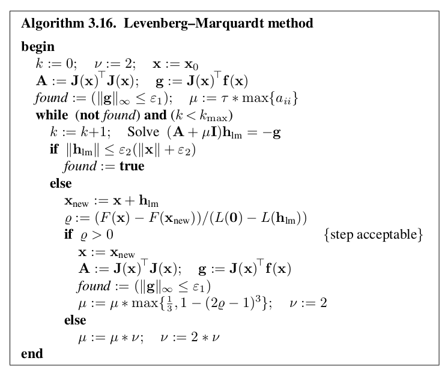

# ICP算法之理论

## 概述

**ICP(Iterative Closest Point)算法**：迭代最近点算法。通过最近邻确定两个点云的匹配情况，然后转换在同一坐标系下，并最小化误差的(或加权)平方和，求两个点云的相对变换T。如此反复迭代直至满足退出条件。


## 理论推导

参考文献：

> [1] Martínez, J. L., González, J., Morales, J., Mandow, A. and García-Cerezo, A. J. (2006), Mobile robot motion estimation by 2D scan matching with genetic and iterative closest point algorithms. Journal of Field Robotics, 23: 21–34. doi: 10.1002/rob.20104.

理论推导主要参考上述文献，添加详细推导过程。

首先假设不考虑雷达与机器的相对位姿，假设雷达获取的点云数据已经按照相对位姿转换到机器坐标系下。以下提及的点云序号与实际采集点云的顺序无关，仅代表对点云集合的遍历。

首先考虑两帧点云之间的相对位姿变换推导。局部点云与全局点云之间的绝对位姿变换道理上类似，作补充说明。

令第$k$时刻的机器坐标系为$XY_k$，对应获取的雷达点云在机器坐标系下的集合表示为${q_k}$，其中第$j$个点的坐标表示为$(x_k(j), y_k(j))$。当机器运动到第$k+1$时刻，对应获取的雷达点云在机器坐标系$XY_{k+1}$下的集合表示为${q_{k+1}}​$。

记第$k$时刻到第$k+1$时刻，机器的位姿变化了$T_k(\Delta x, \Delta y, \Delta \phi)$。自定义任意世界坐标系$XY_o$，下面将这两帧雷达点云放在同一个坐标系中表示。

首先解释一下，“ICP匹配就是根据不同机器坐标系下的两帧点云之间的旋转和平移变换推测出机器的运动位姿变换的”。举个例子，当机器只进行平移运动时：


从$k$时刻到$k+1$时刻，环境是不变的矩形，机器从圆圈$k$沿机器的$X$轴正方向平移运动到圆圈$k+1$，世界坐标系为自定义的$XY_o$。机器的实际平移运动增量为$T_k$。当机器在$k$时刻时，观察到的周围环境点云用黄色点云表示，坐标系为机器坐标系$XY_k$，当机器在$k+1$时刻时，观察到的周围环境点云用绿色点云表示，坐标系为机器坐标系$XY_{k+1}$。

ICP算法就是找到绿色点云与黄色点云之间的匹配点对，将绿色点云进行平移和旋转，使绿色点云与黄色点云完全重合。此时绿色点云经历的平移和旋转过程，就代表了机器在这段时间内的平移和旋转运动。所以说，ICP匹配是在未知的情况下，将新一帧点云经过某种平移和旋转变换，转换到旧的点云坐标系中，使两个点云完全重叠，对应的平移和旋转变换就代表了机器的运动变化状态。

添加了旋转变换的复杂情况分析是一样的。

### 解析解的推导

继续上面的分析，当机器从$k$时刻到$k+1$时刻，假设位姿变换了$T_k(\Delta x, \Delta y, \Delta \phi)$，用示意图表示为：


**第一步**，将在机器坐标系$XY_{k+1}$下的某一点${q_{k+1}(j)}$转换到机器坐标系$XY_k$下，得到转换后的点$\hat{q}_{k}(j)$。初始的估计坐标变换来自于里程计$T_0(\Delta x_o,\Delta y_o,\Delta \phi_o)$：
$$
\begin{bmatrix}
\hat{x}_k(j) \\
\hat{y}_k(j)
\end{bmatrix} =
\begin{bmatrix}
\cos(-\Delta \phi) & \sin(-\Delta \phi) \\
-\sin(-\Delta \phi) & \cos(-\Delta \phi)
\end{bmatrix}
\begin{bmatrix}
x_{k+1}(j) \\
y_{k+1}(j)
\end{bmatrix}+
\begin{bmatrix}
\Delta x \\ \Delta y
\end{bmatrix} \\
=
\begin{bmatrix}
\cos(\Delta \phi) & -\sin(\Delta \phi) \\
\sin(\Delta \phi) & \cos(\Delta \phi)
\end{bmatrix}
\begin{bmatrix}
x_{k+1}(j) \\
y_{k+1}(j)
\end{bmatrix}+
\begin{bmatrix}
\Delta x \\ \Delta y
\end{bmatrix}
$$
注：$\Delta \phi$表示准时针转动。

**第二步**，遍历新一帧经过坐标转换后的点云$\{\hat{q}_k\}$，对坐标转换后的点云中的每个点$\hat{q}_k(j)$计算其与旧一帧的点云$\{q_k\}$中每个点之间的平方距离，记为$e(i,j)$：
$$
e(i,j)=(x_k(i)-\hat{x}_k(j))^2+(y_k(i)-\hat{y}_k(j))^2
$$
注：其中，$i\in \text{number of } \{q_k\}$，$j \in \text{number of }\{\hat{q}_k\} $。

**第三步**，对每个经过坐标转换后的点$\hat{q}_k(j)$，都有一帧数量的平方距离，取其中平方距离最小的对应点作为$\hat{q}_k(j)$的匹配点$q_k(J(j))$：
$$
J(j)=m, \text{if } e(m,j)=\min^N_{i=0}[e(i,j)]
$$
注：在经过坐标转换后的帧$\{\hat{q}_k\}$中，第$j$个点在旧一帧$\{q_k\}$中的对应点序号为$J(j)$。

那么，当前猜测位姿变换$T_k$下的匹配误差表示为：
$$
e_{T_k}(j)=e_{T_k}[\hat{q}_k(j),q_k(J(j))] \\
e_{T_k}(j)=(x_k(J(j))-\hat{x}_k(j))^2+(y_k(J(j))-\hat{y}_k(j))^2 \\
=(x_k(J(j))-x_{k+1}(j)\cos(\Delta \phi)+y_{k+1}(j)\sin(\Delta \phi)-\Delta x)^2 \\ 
+(y_k(J(j))-x_{k+1}(j)\sin(\Delta \phi)-y_{k+1}(j)\cos(\Delta \phi)-\Delta y)^2
$$
==注：步骤2-3合在一起可以用KD-tree来加速计算，直接在当前猜测位姿变换下寻找当前帧在旧一帧中的最近点，并计算平方距离。==

实际并不是所有的点都会参与计算，需要排除一部分外点，比如说在寻找最近点时，能找到的最近点距离很远，很可能是两个不相关的点，这样的点对不在后续计算范围内，容易导致匹配误差。外点通过设定阈值来去除：
$$
p_{T_k}(j)=
\begin{cases}
0 & \text{if } |e_{T_k}(j)| \geq E \\
1 & \text{otherwise}
\end{cases}
$$
==注：这个筛选外点的系数为布尔变量，因此classic-ICP又称boolean-ICP。==

最后剩余的有效点个数为：
$$
n_{T_k}=\sum^N_{p=0}p_{T_k}(j)
$$
有效点与总点云点数的比例为：
$$
P_{T_k}=\frac{n_{T_k}}{N+1}
$$
这个比例决定了两帧点云在经过了一个猜测的位姿变化转换后是否有重叠部分，重叠部分的比例又是多少。如果完全不重叠，那么这个猜测位姿变换就是不合理的。

**由于车辆运动引起的变形、伪距、随机噪声、地形不平度、混合像素、遮挡区域、离散角度分辨率、运动物体等诸多因素**，使得不同扫描点之间无法精确对应，因此可以认为扫描匹配作为一个确定一个二维转换的优化问题，它最小化了一个很好的匹配标准$I_{T_k}$。
$$
I_{T_k}=\frac{\sum^N_{j=0}[p_{T_k}(j)e_{T_j}(j)]}{n_{T_k}}\frac{1}{P_{T_k}}
$$
注：其中，前一个分数表示误差均值，后一个分数表示惩罚低的匹配率。

**最后**，当上式取得最小值时，对应的$T_k$就是当前两帧点云之间的位姿变换。对$I_{T_k}$求偏导：
$$
\frac{\partial I_{T_k}}{\partial \Delta x}
=0=\frac{1}{n_{T_k}P_{T_k}}\frac{\partial \sum^N_{j=0}[p_{T_k}(j)e_{T_j}(j)]}{\partial \Delta x} \\
=\frac{1}{n_{T_k}P_{T_k}} \sum^N_{j=0}[p_{T_k}(j) \frac{\partial e_{T_j}(j)}{\partial \Delta x}] \\
=\frac{1}{n_{T_k}P_{T_k}} \sum^N_{j=0}[p_{T_k}(j)(-2(x_k(J(j))-x_{k+1}(j)\cos(\Delta \phi)+y_{k+1}(j)\sin(\Delta \phi)-\Delta x))]
$$
省略不变的系数后，得到：
$$
\Delta x^{new} = \frac{1}{n_{T_k}} \sum^N_{j=0}[p_{T_k}(j) \Delta x] \\
= \frac{1}{n_{T_k}} \sum^N_{j=0}[p_{T_k}(j)(x_k(J(j))-x_{k+1}(j)\cos(\Delta \phi)+y_{k+1}(j)\sin(\Delta \phi))] \\
=\frac{1}{n_{T_k}} \left[ \sum^N_{j=0}[p_{T_k}(j)x_k(J(j))]- \\
\sum^N_{j=0}[p_{T_k}(j)x_{k+1}(j)]\cos(\Delta \phi)+ \\
\sum^N_{j=0}[p_{T_k}(j)y_{k+1}(j)]\sin(\Delta \phi) \right]
$$
同理对$\Delta y$求偏导得到：
$$
\frac{\partial I_{T_k}}{\partial \Delta y}
=0=\frac{1}{n_{T_k}P_{T_k}}\frac{\partial \sum^N_{j=0}[p_{T_k}(j)e_{T_j}(j)]}{\partial \Delta y} \\
=\frac{1}{n_{T_k}P_{T_k}} \sum^N_{j=0}[p_{T_k}(j) \frac{\partial e_{T_j}(j)}{\partial \Delta y}] \\
=\frac{1}{n_{T_k}P_{T_k}} \sum^N_{j=0}[p_{T_k}(j)(-2(y_k(J(j))-x_{k+1}(j)\sin(\Delta \phi)-y_{k+1}(j)\cos(\Delta \phi)-\Delta y))]
$$
简化后得到：
$$
\Delta y^{new} = \frac{1}{n_{T_k}} \sum^N_{j=0}[p_{T_k}(j) \Delta y] \\
= \frac{1}{n_{T_k}} \sum^N_{j=0}[p_{T_k}(j)(y_k(J(j))-x_{k+1}(j)\sin(\Delta \phi)-y_{k+1}(j)\cos(\Delta \phi))] \\
=\frac{1}{n_{T_k}} \left[ \sum^N_{j=0}[p_{T_k}(j)y_k(J(j))]- \\
\sum^N_{j=0}[p_{T_k}(j)x_{k+1}(j)]\sin(\Delta \phi)- \\
\sum^N_{j=0}[p_{T_k}(j)y_{k+1}(j)]\cos(\Delta \phi) \right]
$$
同理对$\Delta \phi$求偏导，得到：
$$
\frac{\partial I_{T_k}}{\partial \Delta \phi}
=0=\frac{1}{n_{T_k}P_{T_k}}\frac{\partial \sum^N_{j=0}[p_{T_k}(j)e_{T_j}(j)]}{\partial \Delta \phi} \\
=\frac{1}{n_{T_k}P_{T_k}} \sum^N_{j=0}[p_{T_k}(j) \frac{\partial e_{T_j}(j)}{\partial \Delta \phi}] \\
=\frac{1}{n_{T_k}P_{T_k}} \sum^N_{j=0}[p_{T_k}(j)(2(x_k(J(j))-x_{k+1}(j)\cos(\Delta \phi)+y_{k+1}(j)\sin(\Delta \phi)-\Delta x)(x_{k+1}(j)\sin(\Delta \phi)+y_{k+1}(j)\cos(\Delta \phi)) \\
+2(y_k(J(j))-x_{k+1}(j)\sin(\Delta \phi)-y_{k+1}(j)\cos(\Delta \phi)-\Delta y)(-x_{k+1}(j)\cos(\Delta \phi)+y_{k+1}(j)\sin(\Delta \phi)))] \\
=\frac{1}{n_{T_k}P_{T_k}} \sum^N_{j=0}\{p_{T_k}(j)[(x_k(J(j))x_{k+1}(j)+y_k(J(j))y_{k+1}(j)-x_{k+1}(j)\Delta x-y_{k+1}(j)\Delta y)\sin(\Delta \phi) \\
-(x_k(J(j))y_{k+1}(j)-y_k(J(j))x_{k+1}(j)-y_{k+1}(j)\Delta x+x_{k+1}(j)\Delta y)\cos(\Delta \phi)]\}
$$
继续简化：
$$
\Delta \phi^{new}=\arctan \left(\frac{\frac{1}{n_{T_k}} \sum^N_{j=0}[p_{T_k}(j)(x_k(J(j))y_{k+1}(j)-y_k(J(j))x_{k+1}(j)-y_{k+1}(j)\Delta x+x_{k+1}(j)\Delta y)]}{\frac{1}{n_{T_k}} \sum^N_{j=0}[p_{T_k}(j)(x_{k+1}(j)\Delta x+y_{k+1}(j)\Delta y-x_k(J(j))x_{k+1}(j)-y_k(J(j))y_{k+1}(j))]} \right)
$$
用下列式子代替上式中的部分，继续简化得到：
$$
S_{x_k}=\sum^N_{j=0}[p_{T_k}(j)x_k(J(j))]
$$

$$
S_{y_k}=\sum^N_{j=0}[p_{T_k}(j)y_k(J(j))]
$$

$$
S_{x_{k+1}}=\sum^N_{j=0}[p_{T_k}(j)x_{k+1}(J(j))]
$$

$$
S_{y_{k+1}}=\sum^N_{j=0}[p_{T_k}(j)y_{k+1}(J(j))]
$$

$$
S_{x_kx_{k+1}}=\sum^N_{j=0}[p_{T_k}(j)x_k(J(j))x_{k+1}(j)]
$$

$$
S_{y_kx_{k+1}}=\sum^N_{j=0}[p_{T_k}(j)y_k(J(j))x_{k+1}(j)]
$$

$$
S_{x_ky_{k+1}}=\sum^N_{j=0}[p_{T_k}(j)x_k(J(j))y_{k+1}(j)]
$$

$$
S_{y_ky_{k+1}}=\sum^N_{j=0}[p_{T_k}(j)y_k(J(j))y_{k+1}(j)]
$$

$$
\Delta x^{new}=\frac{S_{x_k}-S_{x_{k+1}}\cos(\Delta \phi)+S_{y_{k+1}}\sin(\Delta \phi)}{n_{T_k}}
$$

$$
\Delta y^{new}=\frac{S_{y_k}-S_{x_{k+1}}\sin(\Delta \phi)-S_{y_{k+1}}\cos(\Delta \phi)}{n_{T_k}}
$$

$$
\Delta \phi^{new}=\arctan \left(\frac{S_{x_ky_{k+1}}-S_{y_kx_{k+1}}-S_{y_{k+1}}\Delta x+S_{x_{k+1}}\Delta y}{S_{x_{k+1}}\Delta x+S_{y_{k+1}}\Delta y-S_{x_kx_{k+1}}-S_{y_ky_{k+1}}} \right)
$$

多元函数用偏导数求极值不一定能够解算出来。比如上述三个偏导函数分别包含另外的变量。此处将已经简化的$\Delta x^{new}$和$\Delta y^{new}$代入第三个偏导函数中进一步简化公式，得到：
$$
\Delta \phi^{new}=\arctan \left(\frac{n_{T_k}S_{x_ky_{k+1}}-n_{T_k}S_{y_kx_{k+1}}-S_{x_k}S_{y_{k+1}}+S_{x_{k+1}}S_{y_k}-(S_{x_{k+1}}^2+S_{y_{k+1}}^2)\sin(\Delta \phi)}{S_{x_k}S_{x_{k+1}}+S_{y_k}S_{y_{k+1}}-n_{T_k}S_{x_kx_{k+1}}-n_{T_k}S_{y_ky_{k+1}}-(S_{x_{k+1}}^2+S_{y_{k+1}}^2)\cos(\Delta \phi)} \right) \\
\approx \arctan \left(\frac{n_{T_k}S_{x_ky_{k+1}}-n_{T_k}S_{y_kx_{k+1}}-S_{x_k}S_{y_{k+1}}+S_{x_{k+1}}S_{y_k}}{S_{x_k}S_{x_{k+1}}+S_{y_k}S_{y_{k+1}}-n_{T_k}S_{x_kx_{k+1}}-n_{T_k}S_{y_ky_{k+1}}} \right)
$$
注：最后的近似舍去是从结论倒推出来的。

那么$(\Delta x^{new},\Delta y^{new},\Delta \phi^{new})$的解析解就是通过上述最后三个公式表达的。

对应在MRPT中的代码表示为：

```c++
bool  tfest::se2_l2(
	const TMatchingPairList & in_correspondences,
	TPose2D                 & out_transformation,
	CMatrixDouble33         * out_estimateCovariance )
{
	MRPT_START

	const size_t N = in_correspondences.size();

	if (N<2) return false;

	const float N_inv = 1.0f/N;  // For efficiency, keep this value.

	// ----------------------------------------------------------------------
	// Compute the estimated pose. Notation from the paper:
	// "Mobile robot motion estimation by 2d scan matching with genetic and iterative
	// closest point algorithms", J.L. Martinez Rodriguez, A.J. Gonzalez, J. Morales
	// Rodriguez, A. Mandow Andaluz, A. J. Garcia Cerezo,
	// Journal of Field Robotics, 2006.
	// ----------------------------------------------------------------------
	float SumXa=0, SumXb=0, SumYa=0, SumYb=0;
	float Sxx=0, Sxy=0, Syx=0, Syy=0;

	for (TMatchingPairList::const_iterator corrIt=in_correspondences.begin(); corrIt!=in_correspondences.end(); corrIt++)
	{
		// Get the pair of points in the correspondence:
		const float xa = corrIt->this_x;
		const float ya = corrIt->this_y;
		const float xb = corrIt->other_x;
		const float yb = corrIt->other_y;

		// Compute the terms:
		SumXa+=xa;
		SumYa+=ya;

		SumXb += xb;
		SumYb += yb;

		Sxx += xa * xb;
		Sxy += xa * yb;
		Syx += ya * xb;
		Syy += ya * yb;
	}	// End of "for all correspondences"...

	const float	mean_x_a = SumXa * N_inv;
	const float	mean_y_a = SumYa * N_inv;
	const float	mean_x_b = SumXb * N_inv;
	const float	mean_y_b = SumYb * N_inv;

	// Auxiliary variables Ax,Ay:
	const float Ax = N*(Sxx + Syy) - SumXa*SumXb - SumYa*SumYb;
	const float Ay = SumXa * SumYb + N*(Syx-Sxy)- SumXb * SumYa;

	out_transformation.phi = (Ax!=0 || Ay!=0) ? atan2( static_cast<double>(Ay), static_cast<double>(Ax)) : 0.0;

	const double ccos = cos( out_transformation.phi );
	const double csin = sin( out_transformation.phi );

	out_transformation.x = mean_x_a - mean_x_b * ccos + mean_y_b * csin;
	out_transformation.y = mean_y_a - mean_x_b * csin - mean_y_b * ccos;
    
	return true;

	MRPT_END
}
```

一个完整的ICP迭代过程，从最初的假设位姿$T_0(0,0,0)$或者由里程计提供一个初始假设位姿$T_0(\Delta x_0, \Delta y_0,\Delta \phi_0)$，进行一次ICP循环过程，经历上述四步，找到当前假设位姿下的配对点，并用解析公式求得算法认为的位姿增量$T_k(\Delta x_k,\Delta y_k,\Delta \phi_k)$。此时需要判断迭代是否收敛，位姿是否已经达到最优，配对点是否不再发生变化或者变化小于阈值等。如果没有收敛，ICP将用当前计算出的位姿增量$T_k$作为下次迭代的假设位姿，继续四步迭代计算。直到收敛。

**步骤：**

1. 根据初始位姿$T_0$寻找点云之间的配对关系$c(i)$
2. 根据配对关系$c(i)$计算点云之间的误差平方和$J$
3. 根据最小化误差平方和$J$计算解析解位姿$T$
4. 判断解析解是否收敛，若不收敛，则更新初始位姿$T_0=T$继续迭代，反之，结束迭代，获得局部最优解

**伪代码：**

```pseudocode
for iter = 1 : nIteration
	transform newScan by T0
    for i = 1 : nNewScanSize
        d_min = 无穷大;
        for k = 1 : nRefScanSize
            d_ik = Euclidean(S_new(i),S_ref(k))
            if d_ik < d_min
                d_min = d_ik
                c(i) = k
            end if
        end for
    end for
    use c(i) to cal T
    if |T-T0| < threshold
    	break;
    else
    	T0 = T
    end if
end for
```

**结论：**

- 解析解的推导如上述所示。
- ICP从一系列匹配点对是可以直接解算出当前的位姿变换的。并且==只要匹配点对没有发生变化，解算的结果是一样的==。这也是ICP迭代收敛的条件之一。
- ICP的迭代是没有上限的，需要人为定义收敛条件，比如说当两次配对点对不发生变化了，认为当前位姿已经是收敛的结果了。
- 当两个点云已经很接近重叠了，ICP获取的匹配点对变化也越来越小，整体的误差变化也越来越小，解算出的位姿增量变化也越来越慢。但是只要有一组配对点发生了变化，对ICP来说就没有达到收敛，所以收敛会越来越慢。
- 大旋转角度下，ICP只根据最近的点最为配对点，ICP找到的配对点并不代表真实情况下的配对点，所以这种最近关系对于旋转变化没有什么帮助；反而是当机器发生平移，根据最近点的配对关系，很容易将发生平移的点对配对成功。

最后补充说明，把新一帧点云投影到旧一帧点云坐标系中，得到机器运动位姿的变化量，同理，将新一帧点云投影到全局坐标系中，得到机器运动的绝对位姿。


### LM优化解的推导

ICP算法的另一种求解方式是优化方式，常用的算法为LM优化算法（iterative least-squares: Levenberg-Marquardt，是一种damped Gauss-Newton method算法）。

在单次迭代过程中，对两帧点云根据初始位姿$T_0$寻找配对点的过程是一样的。区别在于解析解方法直接根据配对信息计算出位姿，而优化方法要经过内部的迭代过程获取当前最优的位姿。

LM算法需要对每一个待估参数求偏导，所以，如果目标函数$f$非常复杂，或者待估参数相当地多，那么可能不适合使用LM算法，而可以选择Powell算法——Powell算法不需要求导。

至于这个求导过程是如何实现的，一种方法是拿到函数的方程，然后手工计算出其偏导数方程，进而在函数中直接使用，这样做是最直接，求导误差也最小的方式。不过，在不知道函数的形式之前，就不能这样做了——例如，提供给了用户在界面上输入数学函数式的机会，然后在程序中解析其输入的函数，再做后面的处理。在这种情况下，需要使用数值求导算法。一些优秀的求导算法——例如[Ridders算法](http://www.codelast.com/?p=1419)——在一次求导数值过程中，需要计算的函数值次数也会达到5次以上。这样的话，它当然要比手工求出导函数（只需计算一次，就可以得到导数值）效率要差得多了。

关于高斯-牛顿方法需自行补充。该方法在每次迭代中求出一个步长$\bf{h}$，也就是位姿的变化量，使得位姿从初始位姿起，逐渐下降到局部最优的位姿。步长$\bf{h}_{\rm{lm}}$被定义为：
$$
(\bf{J}^\rm{T}\bf{J}+\mu \bf{I})\bf{h}_\rm{lm}=-\bf{g} \quad \rm{\text{with}} \quad \bf{g}=\bf{J}^{\rm{T}}\bf{f} \quad \rm{\text{and}} \quad \mu \ge 0 \quad \rm{\text{.}}
$$
这里，$\bf{J}=\bf{J(\rm{x})}$和$\bf{f}=\bf{f(\rm{x})}$。步长$\bf{h_{\rm{lm}}}$被确保为下降方向。

$\mu$值称为阻尼参数。根据不同的$\mu$值，步长$\bf{h_{\rm{lm}}}$有不同的近似结果，对远离最优解时取小的变化步长，对靠近最优值时取大的变化步长。$\mu$值同时影响了下降方向和步长，使得该方法不需要**线搜索**。
$$
\bf{h}_{\rm{lm}} =
\begin{cases}
-\frac{1}{\mu}\bf{g}=-\frac{1}{\mu}\bf{F'}\rm{(}\bf{x}\rm{)},  & \text{if $\mu$ is large} \\
\bf{h}_{\rm{gn}}, & \text{if $n$ is small}
\end{cases}
$$
**伪代码：**



MRPT中的实现：

```c++
// Compute the estimated pose through iterative least-squares: Levenberg-Marquardt
// ----------------------------------------------------------------------
dJ_dq.setSize(3,nCorrespondences);  // The jacobian of the error function wrt the transformation q

double  lambda = options.LM_initial_lambda;		// The LM parameter

double  ccos = cos(q.phi());
double	csin = sin(q.phi());

double  w1,w2,w3;
double  q1,q2,q3;
double  A,B;
const double  Axy = options.Axy_aprox_derivatives;		// For approximating the derivatives

// Compute at once the square errors for each point with the current "q" and the transformed points:
std::vector<float> sq_errors;
correspondences.squareErrorVector( q, sq_errors, other_xs_trans,other_ys_trans);
double OSE_initial = math::sum( sq_errors );

// Compute "dJ_dq" : 3-9ms
// ------------------------------------
double  rho2 = square( options.kernel_rho );
mrpt::utils::TMatchingPairList::iterator	it;
std::vector<float>::const_iterator other_x_trans,other_y_trans;
size_t  i;

for (i=0,
     it=correspondences.begin(),
     other_x_trans = other_xs_trans.begin(),
     other_y_trans = other_ys_trans.begin();
     i<nCorrespondences;
     ++i, ++it,++other_x_trans,++other_y_trans )
{
    // Jacobian: dJ_dx
    // --------------------------------------
    //#define ICP_DISTANCES_TO_LINE

    #ifndef ICP_DISTANCES_TO_LINE
    w1= *other_x_trans-Axy;
    q1 = m1->squareDistanceToClosestCorrespondence( w1, *other_y_trans );
    q1= kernel( q1, rho2 );

    w2= *other_x_trans;
    q2 = m1->squareDistanceToClosestCorrespondence( w2, *other_y_trans );
    q2= kernel( q2, rho2 );

    w3= *other_x_trans+Axy;
    q3 = m1->squareDistanceToClosestCorrespondence( w3, *other_y_trans );
    q3= kernel( q3, rho2 );
    #else
    // The distance to the line that interpolates the TWO closest points:
    float  x1,y1, x2,y2, d1,d2;
    m1->kdTreeTwoClosestPoint2D(
        *other_x_trans, *other_y_trans, 	// The query
        x1, y1,   // Closest point #1
        x2, y2,   // Closest point #2
        d1,d2);

    w1= *other_x_trans-Axy;
    q1 = math::closestSquareDistanceFromPointToLine( w1, *other_y_trans,  x1,y1, x2,y2 );
    q1= kernel( q1, rho2 );

    w2= *other_x_trans;
    q2 = math::closestSquareDistanceFromPointToLine( w2, *other_y_trans,  x1,y1, x2,y2 );
    q2= kernel( q2, rho2 );

    w3= *other_x_trans+Axy;
    q3 = math::closestSquareDistanceFromPointToLine( w3, *other_y_trans,  x1,y1, x2,y2 );
    q3= kernel( q3, rho2 );
    #endif
    //interpolate
    A=(  (q3-q2)/((w3-w2)*(w3-w1))  ) - (  (q1-q2)/((w1-w2)*(w3-w1))  );
    B=(   (q1-q2)+(A*((w2*w2)-(w1*w1)))   )/(w1-w2);

    dJ_dq.get_unsafe(0,i) = (2*A* *other_x_trans)+B;

    // Jacobian: dJ_dy
    // --------------------------------------
    w1= *other_y_trans-Axy;
    #ifdef ICP_DISTANCES_TO_LINE
    q1 = math::closestSquareDistanceFromPointToLine( *other_x_trans, w1,  x1,y1, x2,y2 );
    q1= kernel( q1, rho2 );
    #else
    //square(it->this_x - *other_x_trans)+ square( it->this_y - w1 )!=m1->squareDistanceToClosestCorrespondence( *other_x_trans, w1 )
    q1= kernel( square(it->this_x - *other_x_trans)+ square( it->this_y - w1 ),  rho2 );
    #endif

    w2= *other_y_trans;
    // q2 is alreay computed from above!
    //q2 = m1->squareDistanceToClosestCorrespondence( *other_x_trans, w2 );
    //q2= kernel( square(it->this_x - *other_x_trans)+ square( it->this_y - w2 ),  rho2 );

    w3= *other_y_trans+Axy;
    #ifdef ICP_DISTANCES_TO_LINE
    q3 = math::closestSquareDistanceFromPointToLine( *other_x_trans, w3,  x1,y1, x2,y2 );
    q3= kernel( q3, rho2 );
    #else
    q3= kernel( square(it->this_x - *other_x_trans)+ square( it->this_y - w3 ),  rho2 );
    #endif

    //interpolate
    A=(  (q3-q2)/((w3-w2)*(w3-w1))  ) - (  (q1-q2)/((w1-w2)*(w3-w1))  );
    B=(   (q1-q2)+(A*((w2*w2)-(w1*w1)))   )/(w1-w2);

    dJ_dq.get_unsafe(1,i) = (2*A* *other_y_trans)+B;

    // Jacobian: dR_dphi
    // --------------------------------------
    dJ_dq.get_unsafe(2,i) = dJ_dq.get_unsafe(0,i) * ( -csin * it->other_x - ccos * it->other_y )  +
        dJ_dq.get_unsafe(1,i) * (  ccos * it->other_x - csin * it->other_y );

} // end for each corresp.

// Now we have the Jacobian in dJ_dq.

// Compute the Hessian matrix H = dJ_dq * dJ_dq^T : 1ms
CMatrixFloat  H_(3,3);
H_.multiply_AAt(dJ_dq);

CMatrixFixedNumeric<float,3,3>  H = CMatrixFixedNumeric<float,3,3>(H_);

bool  keepIteratingLM = true;

// ---------------------------------------------------
// Iterate the inner LM loop until convergence:
// ---------------------------------------------------
q_new = q;

std::vector<float>  new_sq_errors, new_other_xs_trans, new_other_ys_trans;
size_t   		nLMiters = 0;
const size_t 	maxLMiters = 100;//100iter->50ms

while ( keepIteratingLM &&  ++nLMiters<maxLMiters)
{
    // The LM heuristic is:
    //  x_{k+1} = x_k  - ( H + \lambda diag(H) )^-1 * grad(J)
    //  grad(J) = dJ_dq * e (vector of errors)
    C = H;
    for (i=0;i<3;i++)
        C(i,i) *= (1+lambda);	// Levenberg-Maquardt heuristic

    C_inv = C.inv();

    // LM_delta = C_inv * dJ_dq * sq_errors
    Eigen::VectorXf  dJsq, LM_delta;
    dJ_dq.multiply_Ab( Eigen::Map<Eigen::VectorXf>(&sq_errors[0],sq_errors.size()), dJsq );
    C_inv.multiply_Ab(dJsq,LM_delta);

    q_new.x( q.x() - LM_delta[0] );
    q_new.y( q.y() - LM_delta[1] );
    q_new.phi( q.phi() - LM_delta[2] );

    // Compute the new square errors:
    // ---------------------------------------
    correspondences.squareErrorVector(
        q_new,
        new_sq_errors,
        new_other_xs_trans,
        new_other_ys_trans);

    float OSE_new = math::sum( new_sq_errors );

    bool improved = OSE_new < OSE_initial;

    #if 0  // Debuggin'
    cout << "_____________" << endl;
    cout << "q -> q_new   : " << q << " -> " << q_new << endl;
    printf("err: %f  -> %f    lambda: %e\n", OSE_initial ,OSE_new, lambda );
    cout << "\\/J = "; utils::operator <<(cout,dJsq); cout << endl;
    mrpt::system::pause();
    #endif

    keepIteratingLM =
        fabs(LM_delta[0])>options.minAbsStep_trans ||
        fabs(LM_delta[1])>options.minAbsStep_trans ||
        fabs(LM_delta[2])>options.minAbsStep_rot;

    if(improved)
    {
        //If resids have gone down, keep change and make lambda smaller by factor of 10
        lambda/=10;
        q=q_new;
        OSE_initial = OSE_new;
    }
    else
    {
        // Discard movement and try with larger lambda:
        lambda*=10;
    }

} // end iterative LM
```

