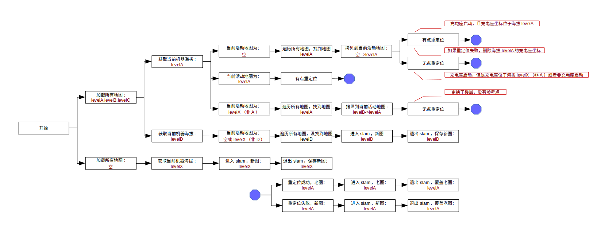

# 多地图重定位逻辑

## 目标

同时保存多个楼层的地图，在重定位前从多个地图中找到当前楼层的地图，进行重定位。

- 方法一：遍历所有地图，进行 N 次重定位
- 方法二：给每层地图添加海拔信息，根据当前海拔数据直接搜索对应海拔的地图，进行一次重定位

## 逻辑

按照方法二构建如下多地图重定位逻辑。

==下述地图包含成对儿的网格地图(gridMap)和点云地图(pointsMap)，代码中需要分别编写对两种地图的赋值过程，并注意地图的配对。网格地图用于重定位粗匹配，点云地图用于重定位细匹配。如果重定位成功，网格地图和点云地图一起用于初始化ICP-SLAM，提高效率和精度。==

楼层的海拔用 level 区分，比如有三个不同海拔的地图，分别用 levelA 、 levelB 、 levelC 表示。将海拔信息添加到网格地图的属性中，用接口`getAltitude()`获取当前网格地图的海拔。

区分以下两种地图：

- 从系统加载的所有楼层的地图，包括 levelA 、 levelB 、 levelC 等，加载后一直存储在 SlamActor 中，在每次重定位成功后提供某个海拔的地图进入 SLAM
- 每次进入 SLAM ，并提供给导航等其他模块使用的当前海拔的地图 levelX （可以是上述 levelA 、 levelB 、 levelC 海拔的地图，或者是新建的 levelD 海拔的地图）

