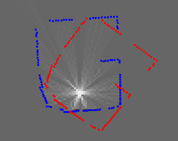
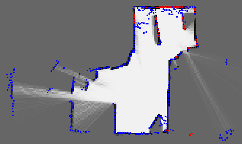
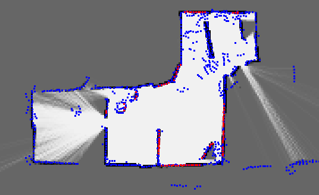
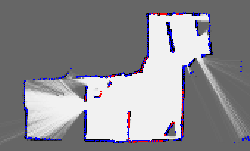
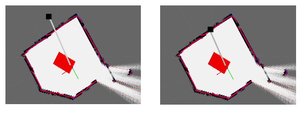

# <center>建图相关</center>

<center>作者：于欢</center>

## 1. 需求与目的

- 提高算法性能。

- 提升用户体验感。

## 2. 竞品测试

手机端显示的地图边界是细的。

## 3. 方案设计（包含流程图）

建图相关的问题分为两个部分：点云地图和网格地图。

### 3.1 点云地图

点云地图用于slam内部进行icp匹配算法时，比较当前点与和整个环境的点云地图，计算出当前位姿。点云地图仅影响icp匹配算法的性能。

#### 3.1.1  点云地图的格式

由一组坐标组成，有三个vector分别记录每个点在地图上的坐标(x,y,z)。

```c++
std::vector<float>     x,y,z;        //!< The point coordinates
```

#### 3.1.2 点云地图的插入

点云地图每次插入一个点，就是向vector中插入对应的坐标(x,y,z)。点云地图的插入没有顺序关系。

```c++
void  CSimplePointsMap::insertPointFast( float x, float y, float z )
{
	this->x.push_back(x);
	this->y.push_back(y);
	this->z.push_back(z);
}
```

点云地图的其他单点操作，就是对vector进行操作，插入、重置、清空、拷贝等。

对于一帧雷达点云，将其插入到点云地图的过程，就是将每个点云从(range, angle)转换到世界坐标系下的(x,y,z)，再插入到点云地图中。

#### 3.1.3 点云地图与匹配算法的关系

用以下图示来说明点云地图在匹配算法中的应用：



其中，蓝色的点云是参考点云地图，红色的点云是当前新一帧雷达点云形成的点云地图。icp匹配算法方法之一就是利用两个点云地图中的点进行匹配。对每一个帧雷达点云形成的红色的点云地图，遍历其中的点，并在参考点云地图中寻找欧式距离最近的点，配成对，遍历完成后，所有的成对儿的点用来计算当前机器位姿。（解析解）

**遍历参考点云地图时间长**

以上是单个小环境的点云地图匹配情况。对于复杂的环境，由于激光雷达每次只能覆盖一定的范围，形成局部点云地图，而实际的参考点云地图是激光雷达覆盖过的所有环境点的集合，如下图所示：



整个环境形成的参考点云地图（蓝色点）中的点数很大，而当前局部点云地图（红色点）的点数不超过一帧雷达点云数量。在遍历局部点云地图的点时，需要在参考点云地图中寻找欧式距离最近的点，MRPT中使用KD-tree进行加速。由于代表整个环境的参考点云地图的点数只会不断增加，寻找最近点的时间也会越来越长。

**很多杂散的点影响匹配效果**

从上图中可以看到，由于激光雷达测距存在误差，并不是一帧点云中的每个点的测距结果都是准确的，有时候因为机器的倾斜，也会时激光雷达照到地面。并不是所有的点都会参与匹配算法，但是所有的点最终都会插入到参考点云地图中，导致参考点云地图包含很多无效的点或者冗余的点。

这些无效的点或者冗余的点在匹配中，如果被寻找为配对点，就有可能引起位姿解析的偏差。

#### 3.1.4 点云地图的优化

点云地图的优化，一方面考虑限制点云地图中点的数量的增长，另一方面考虑删除冗余的点，保留一定数量的点，足够用于匹配算法即可。

**限制点云地图中点数的增长**

方案：仅在沿边和导航时**允许**更新点云地图。

理由：机器仅在沿边和导航时，会有可能进入新的环境，需要将激光雷达观测到的新环境添加到参考点云地图中；在覆盖时，是在已经观测好的环境中不断重复观测，此时再将激光雷达观测到的环境添加到参考点云地图中，就会增加点云地图的数量，并且时点云地图中障碍物边界越来越粗糙。

```c++
m_robotSlamPtr->enableMapUpdating(m_isFollowWall);
m_robotSlamPtr->processSlam(slamSensorData);
```

**删除点云地图中冗余的点**

方案：在覆盖时**允许**优化点云地图。

理由：机器在沿边和导航时，有可能探索新的环境，点云地图有可能还在更新，此时不建议对参考点云地图进行精简，容易导致匹配率下降，从而导致点云地图发生偏移；在覆盖时，点云地图已经暂时不再更新了，地图处于稳定状态，此时精简点与地图中的点不会影响匹配算法。

精简前的参考点云地图（蓝色点）：



精简后的参考点云地图（蓝色点）：



点云地图的精简方法：

- 细化当前网格地图（见3.2节网格地图），把粗糙的障碍物边界细化，如上图黑色格子所示。
- 遍历参考点云地图，保留对应网格地图中黑色格子上的点。舍弃其他格子上的点。
- 注意判断精简后的点云地图中的点数是否满足一定条件，避免误删所有的点。

代码说明：

```c++
if (update)
{
    CPose3D estimatedPose3D(currentKnownRobotPose);

    //TODO:先更新gridmap，检查是否有地图错误，如果没有错误，再更新pointmap
    const bool anymap_update = metricMap.m_gridMaps[0]->insertObservationPtr(obs, &estimatedPose3D);
    countUpdateGdMap++;
    m_lastUpdateGdMap = true;
    MRPT_LOG_INFO_STREAM("update grid map. (" << countUpdateGdMap << ")");

    m_mapIsWrong = metricMap.m_gridMaps[0]->getMapStatus();
    MRPT_LOG_INFO_STREAM("get map status : " << (!m_mapIsWrong ? "right" : "wrong"));

    if (options.enableMapUpdating && !m_mapIsWrong)
    {
        countUpdatePtMap++;
        metricMap.m_pointsMaps[0]->insertObservationPtr(obs, &estimatedPose3D);
        m_lastUpdatePtMap = true;
        MRPT_LOG_INFO_STREAM("update points map. (" << countUpdatePtMap << ")");
    }
}
//refine grid map and points map when covering
else if (!options.enableMapUpdating)
{
    if (m_lastUpdateGdMap && countUpdateGdMap > 30 && m_lastUpdatePtMap)
    {
        ///refine gridMap in order to optimize the pointsMap
        COccupancyGridMap2D gridMap;
        gridMap.copyMapContentFrom(*metricMap.m_gridMaps[0]);
        gridMap.refineGridMap();
        MRPT_LOG_INFO("refine grid map.");

        ///delete points that are not in the black cells after refined grid map
        unsigned int sizeX = gridMap.getSizeX();
        const std::vector<mrpt::maps::COccupancyGridMap2D::cellType>& rawMap = gridMap.getRawMap();
        vector<float> xOut, yOut;
        metricMap.m_pointsMaps[0]->getAllPoints(xOut, yOut);
        vector<float> xIn, yIn;

        for (size_t i = 0; i < xOut.size(); i++)
        {
            //occ -> save
            if (rawMap[gridMap.x2idx(xOut[i]) + sizeX * gridMap.y2idx(yOut[i])] < -5)
            {
                xIn.emplace_back(xOut[i]);
                yIn.emplace_back(yOut[i]);
            }
        }

        if ((float)xIn.size() / (float)xOut.size() > 0.35)
        {
            metricMap.m_pointsMaps[0]->setAllPoints(xIn, yIn);
            MRPT_LOG_INFO("refine points map.");
            countUpdateGdMap = 0;
            m_lastUpdateGdMap = false;
        }
        //reset update points map to avoid try to refine maps when points map is not changed
        m_lastUpdatePtMap = false;
    }
}
```


### 3.2 网格地图

网格地图用于重定位和对外显示，以及当slam内部匹配算法是对网格地图匹配时才有用。当slam内部匹配算法是对点云地图匹配时，网格地图不参与匹配。

#### 3.2.1 网格地图的格式

网格地图由一个vector记录n×m的网格地图中每个格子的灰度值。其他的属性包含：分辨率、XY方向格子数量、实际的地图尺寸等。

灰度值的表示：

- 概率值：0（黑）-0.5（灰）-1（白）
- 离散值：-127（黑）-0（灰）-127（白）

```c++
std::vector<cellType>    map;  //!< Store of cell occupancy values. Order: row by row, from left to right
uint32_t  size_x,size_y; //!< The size of the grid in cells
float     x_min,x_max,y_min,y_max; //!< The limits of the grid in "units" (meters)
float     resolution; //!< Cell size, i.e. resolution of the grid map.
```

#### 3.2.2 网格地图的插入

网格地图新建的时候，默认所有的格子都是灰色的，表示未知状态。网格地图的插入，是指将某个格子涂成黑色或者白色，表示障碍物或者空旷区域。

```c++
/** Change the contents [0,1] of a cell, given its index */
inline void setCell(int x,int y,float value)
{
    // The x> comparison implicitly holds if x<0
    if (static_cast<unsigned int>(x)>=size_x ||	static_cast<unsigned int>(y)>=size_y)
        return;
    else	map[x+y*size_x]=p2l(value);
}
```

在自定义某个格子的属性时，使用以上类似的接口直接修改对应格子的属性即可。类似操作还有：重置、填充相同的属性、修改网格地图尺寸等。

对于一帧雷达点云，将其插入到网格地图的过程，就是将每个点云形成的光束（起点是雷达中心，终点是光束终端）所覆盖的所有网格的属性依次进行修改。光束经过的区域，每个格子的属性增加一定的亮度值，光束终端覆盖的格子属性增加一定的暗度值。

#### 3.2.3 网格地图的优化

网格地图的优化主要用于显示更美观。以及用于点云地图优化的预处理步骤。

**限制错误光束插入网格地图**

方案：在用每帧雷达点云插入形成网格地图时，当前光束在填充网格属性的过程中，如果越过黑色边界到达黑色边界后的白色或者灰色区域填充白色属性，就停止该光束的填充。

理由：在将雷达点云填充成网格地图时，最好的情况是光束覆盖的网格属性都是白色或者灰色，表示光束在空闲区域经过。如果光束覆盖的过程中，越过了黑色障碍物，如果紧接着就是光束终端，那么障碍物边界就会变得粗糙；如果光束越过了黑色障碍物很远，有一段光束都到了障碍物另一侧，那么从理论上来说这条光束的位置就有问题，需要及时终止该光束的插入。并且记录错误插入的光束数量，用于辅助判断建图错误。



判断错误光束的比例：

```c++
for (int nStep = 0;nStep<nStepsRay;nStep++)
{
    //TODO:如果越过黑色边界插入白色线，终端是灰色或者白色，就认为这条线错误
    if (isEdge)
    {
        if(*(theMapArray + (cx+cy*theMapSize_x)) >= p2l(0.5))
        {
            outEdgeCount++;//TODO：统计一帧错误点数
            outEdge = true;
            break;
        }
    }
    if(*(theMapArray + (cx+cy*theMapSize_x)) < p2l(0.5))
    {
        isEdge = true;
    }

    updateCell_fast_free(cx,cy, logodd_free, logodd_thres_free, theMapArray, theMapSize_x );

    frCX += frAcx;
    frCY += frAcy;

    cx = frCX >> FRBITS;
    cy = frCY >> FRBITS;
}

// And finally, the occupied cell at the end:
// Only if:
//  - It was a valid ray, and
//  - The ray was not truncated
if(!outEdge)//TODO：如果这条线错误，就不插入终端黑色的点
{
    if (o->validRange[idx] && o->scan[idx] < maxDistanceInsertion)
    {
        updateCell_fast_occupied(trg_cx, trg_cy, logodd_observation_occupied, logodd_thres_occupied,
                                 theMapArray, theMapSize_x);
        if (scanPoints_x[idx] > m_localMaxX) m_localMaxX = scanPoints_x[idx];
        if (scanPoints_x[idx] < m_localMinX) m_localMinX = scanPoints_x[idx];
        if (scanPoints_y[idx] > m_localMaxY) m_localMaxY = scanPoints_y[idx];
        if (scanPoints_y[idx] < m_localMinY) m_localMinY = scanPoints_y[idx];
    }
}
```

**细化网格地图中障碍物边界**

网格地图的优化按照下图筛选了几种类型的格子，综合周围8个格子的属性，修改中心的黑色格子的属性，达到细化边界的目的。


## 4. 关键问题点

### 4.1 建图错误 

问题：为什么不用icp的匹配结果作为建图错误的标志？

icp在每次匹配后都会返回一个匹配率，表示匹配的好坏程度。最好的结果为fit=100%。最差的可接受结果为fit=40%。在匹配情况较好时匹配率会在90%～100%之间波动。匹配情况较差时匹配率会降到40%～50%。另外，在进入未知环境中，产生新的障碍物信息时，由于缺少参考点云，最终的匹配率也会低于一定值。

并不是每次icp之后都会发生更新地图。还需要满足位姿增量条件才会建图。也就是说，有可能连续几次的icp的匹配率都比较低，但是并没有更新地图，等到某次满足地图更新条件后才更新地图。

那么，在统计匹配率作为建图错误的判断条件，不容易准确判断出地图是否已经发生错误。有可能判断满足条件时，错误的地图还未被更新到地图中。也有可能判断满足条件时，错误的地图已经多次更新到地图中。对后期地图的回溯程度也有影响。

从地图画图中判断错误，能尽早并且准确地判断出错误，保证地图回溯几帧后一定是正确的地图。

### 4.2 优化slam初始化耗时

优化点云地图还有一个有利的地方，就是在slam初始化的时候，如果要从已经有的地图中恢复数据，MRPT提供的接口是：

```c++
void CMetricMapBuilderICP::initialize(
        const CSimpleMap &initialMap,
        CPosePDF *x0) {
    MRPT_START
        MRPT_LOG_INFO("[CMetricMapBuilderICP] initialize()");

        // Reset vars:
        m_estRobotPath.clear();

        m_auxAccumOdometry =  CPose2D(0,0,0);

        m_distSinceLastICP.lin = m_distSinceLastICP.ang = 0;
        m_distSinceLastInsertion.clear();

        m_there_has_been_an_odometry = false;

        // Init path & map:
        mrpt::synch::CCriticalSectionLocker lock_cs(&critZoneChangingMap);

        // Create metric maps:
        metricMap.setListOfMaps(&ICP_options.mapInitializers);

        // copy map:
        SF_Poses_seq = initialMap;

        // Load estimated pose from given PDF:
        m_lastPoseEst.reset();

        if (x0)
            m_lastPoseEst.processUpdateNewPoseLocalization(x0->getMeanVal(), mrpt::system::now());

        for (size_t i=0;i<SF_Poses_seq.size();i++)
        {
            CPose3DPDFPtr posePDF;
            CSensoryFramePtr SF;

            // Get the SF and its pose:
            SF_Poses_seq.get(i, posePDF, SF);

            CPose3D estimatedPose3D;
            posePDF->getMean(estimatedPose3D);

            // Insert observations into the map:
            SF->insertObservationsInto(&metricMap, &estimatedPose3D);
        }
        MRPT_LOG_INFO("loadCurrentMapFromFile() OK.\n");
    MRPT_END
}
```

其中，`SF_Poses_seq`保存了每次更新地图时的点云和位姿信息，在加载地图时，从`SF_Poses_seq`中迭代，将每帧点云按照对应的位姿插入到地图中。这样的好处是数据原始，每帧点云和对应的位姿信息都有，并且同时可以加载多种类型的地图。缺点是十分耗时，加载点云地图和网格地图一般在50秒以上，并且点云地图会十分粗糙，影响最初的匹配效率。

解决：在slam结束后保存网格地图和已经优化好的点云地图，在slam需要加载已经有的地图时，添加直接加载点云地图和网格地图的接口。该方法快速，但是对于后续复杂的需求可能有局限性。


## 5. 主要接口


## 6. 验证结果


## 7. 参考资料


